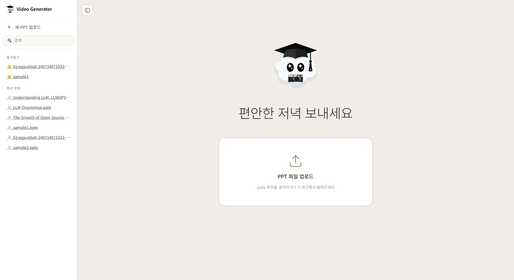
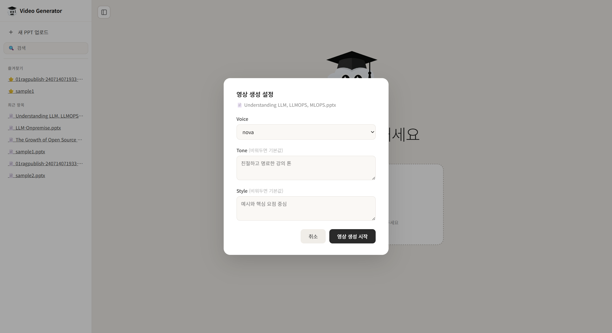
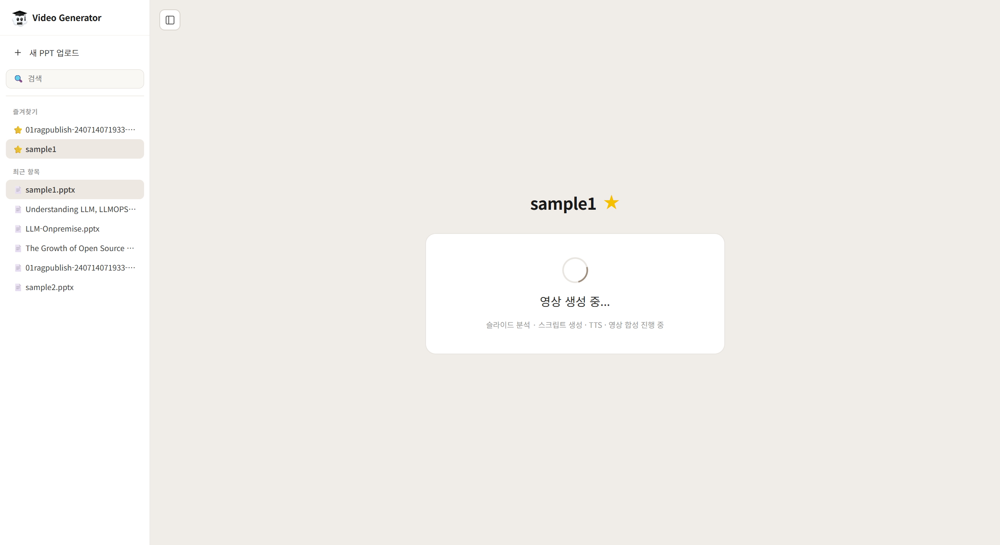
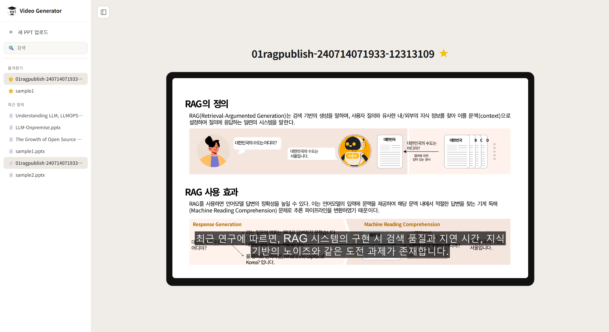
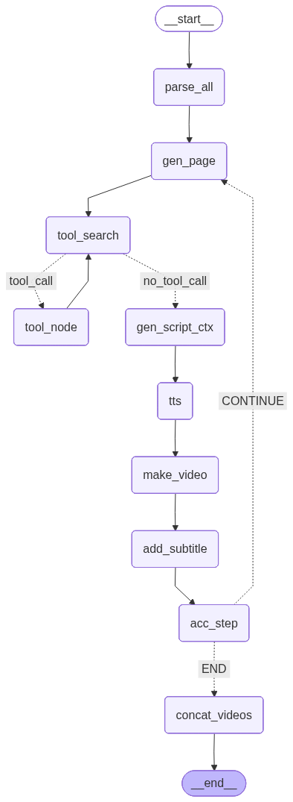
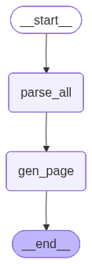
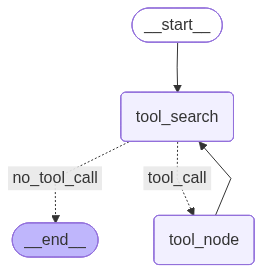
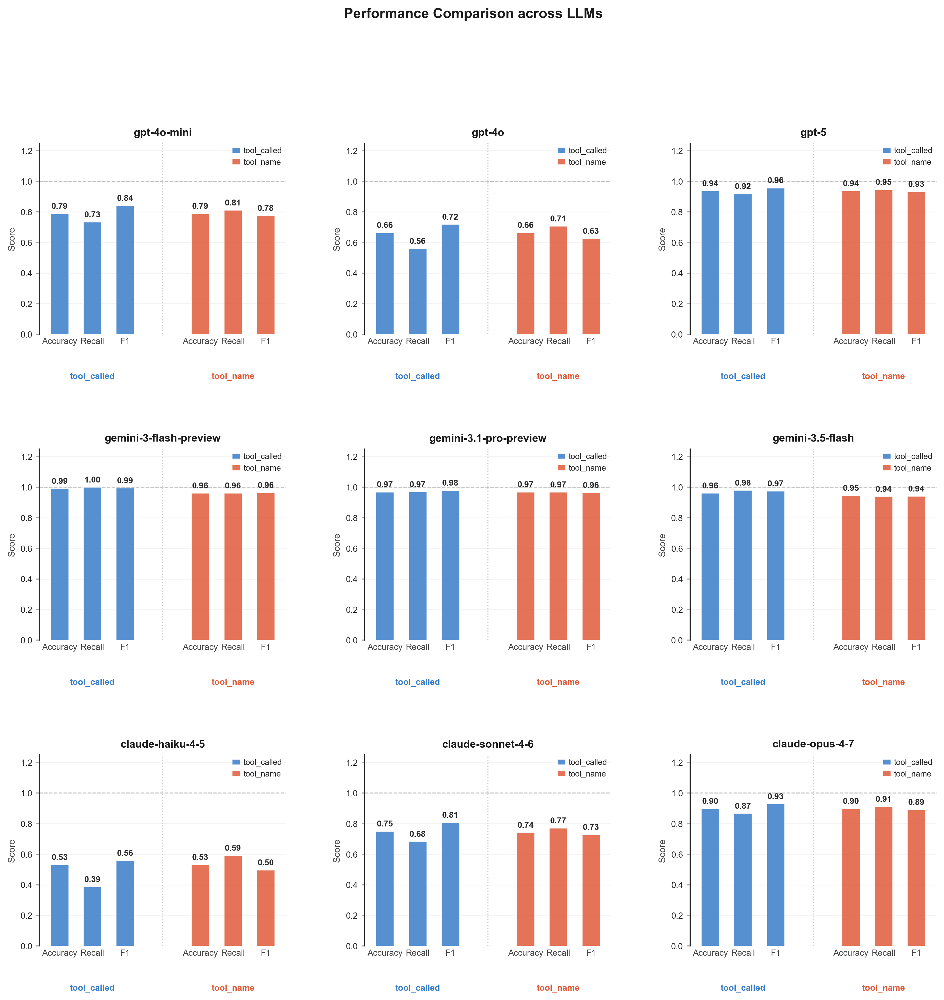
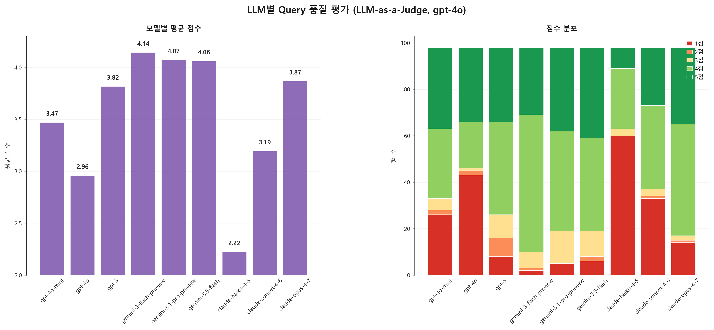

# Index
- [ScreenShots](#screenshots)
- [Stacks](#stacks)
- [Implementation Details](#implementation-details)
  - [State Specifications](#state-specifications)
  - [Node Specifications](#node-specifications)
- [Evaluation](#evaluation)
  - [Test Dataset 생성](#test-dataset-생성)
  - [Test Dataset 무결성 검사](#test-dataset-무결성-검사)
  - [평가](#평가)
    - [tool calling 정확도](#1-tool-calling-정확도)
    - [tool calling Query LLM-as-a-Judge](#2-tool-calling-query-llm-as-a-judge)
- [Special Requirements](#special-requirements)


# Educational_Video_Generator

PPT 기반 교육 동영상 자동 생성 Agent System

## 개요

기업에서는 보고서, 발표자료, 안내문 등 다양한 PPT/PDF 자료가 계속 만들어집니다. DX (Digital Transformation) 시대에 이를 교육 영상으로 만들어 직원 교육에 활용하면 효과적이겠지만, 수동 제작은 스크립트 작성, 녹화, 편집, 자막 삽입에 수일이 걸리고 발표자마다 품질이 들쑥날쑥하다는 문제가 있습니다.


이 문제를 해결하기 위해 본 **Tool Calling 기반 Multi Agent System으로 영상 제작 과정을 자동화**했습니다. PPT 내 텍스트, 이미지, 그래프, 표를 추출하고 이해한 뒤 발표 스크립트 생성, TTS 적용, 자막 삽입까지 한 번에 처리합니다.
또한 자료에 없는 최신 연구나 실무 적용 시 주의점은 웹 검색으로 보완하여, 일정한 품질의 교육 영상을 빠르게 제작할 수 있습니다.

---


# ScreenShots

**메인 페이지**



**영상 업로드**



**영상 처리중**



**완성 영상 조회**



<br><br><br>

# Stacks

- Language : Python
- AI : LangGraph, LangChain, LangSmith, OpenAI, Tavily
- Backend: FastAPI
- Frontend: HTML, CSS, JS
- Others : LibreOffice, python-pptx, FFmpeg

예시 slide 출처 : 
https://www.slideshare.net/slideshow/rag-tutorial-01-rag-pdf/270232354?from_search=1

<br><br><br>


# Implementation Details
## 1. LangGraph Graph



<br><br><br>


## 2. State Specifications

| 이름 | 자료형 | 설명 |
|------|--------|------|
| `pptx_path` | `str` | 입력 PPT 파일 경로 |
| `work_dir` | `str` | 중간 산출물 저장 디렉토리 경로 |
| `prompt` | `Dict` | TTS 목소리·톤·스크립트 스타일 옵션 |
| `slides` | `List[Dict]` | 슬라이드별 파싱 데이터 리스트. 각 요소는 index, title, texts, tables, images, snap, script 포함 |
| `n_slides` | `int` | 전체 슬라이드 수 |
| `slide_index` | `int` | 현재 처리 중인 슬라이드 인덱스. 모든 처리 완료 후에는 n_slides와 같아짐 |
| `cur_search_context` | `str` | 현재 슬라이드에 대한 Tavily 검색 결과 요약. 검색 불필요 시 `'검색 필요 없음'` |
| `cur_page_content` | `str` | 현재 슬라이드 파싱 데이터를 LLM이 정제한 설명문 |
| `cur_script` | `str` | 현재 슬라이드의 강의 스크립트 |
| `cur_audio` | `str` | 현재 슬라이드의 TTS 오디오 파일 경로 |
| `cur_video` | `str` | 현재 슬라이드의 자막 미적용 영상 파일 경로 |
| `cur_video_subtitled` | `str` | 현재 슬라이드의 자막 적용 영상 파일 경로 |
| `video_paths` | `List[str]` | 슬라이드별 자막 영상 경로 누적 리스트 |
| `final_video` | `str` | 전체 슬라이드 영상을 이어붙인 최종 영상 경로 |
| `messages` | `Annotated[list, add_messages]` | Tavily ToolNode 연동용 LangGraph 내부 메시지 목록 |

<br>

**State 전체 값 예시**

```
{'pptx_path': './ppt_examples/01ragpublish-240714071933-12313109.pptx', 
'work_dir': './step1_output',
'prompt': {'voice': 'nova', 'tone': '명확하고 귀여움이 넘치는 톤', 'style': '핵심에 집중하고 예시를 포함하는 깔끔하고 명확한 스타일'}, 
'slides': [
    {'index': 1, 'title': 'R etrieval\nArgumented Generation', 'texts': ['R etrieval\nArgumented Generation'], 'tables': [], 'images': [], 'snap': 'C:\\Users\\User\\PycharmProjects\\Educational_Video_Generator\\step1_output\\slide_img-1.png', 'script': '안녕하세요. 오늘은 Retrieval Argumented Generation, 즉 RAG에 대해 알아보겠습니다. RAG는 정보 검색과 콘텐츠 생성을 결합하여 데이터 활용의 효율성을 극대화하는 방법론입니다. 이 시스템은 필요한 정보를 신속하게 검색하고, 그 정보를 바탕으로 새로운 콘텐츠를 생성하는 과정을 포함합니다. 이러한 통합적 접근 방식은 정보의 활용도를 높이는 데 큰 기여를 합니다. \n\nRAG 시스템 구현 시 발생할 수 있는 도전 과제와 이를 해결하기 위한 전략도 중요합니다. 예를 들어, 검색 품질과 지연 시간을 개선하기 위한 고급 검색 모델이 효과적이라는 점이 강조됩니다.'}, 
    {'index': 2, 'title': 'RAG의 정의', 'texts': ['RAG의 정의', 'RAG(Retrieval-Argumented Generation)는 검색 기반의 생성을 말하며, 사용자 질의와 유사한 내/외부의 지식 정보를 찾아 이를 문맥(context)으로 설정하여 질의에 응답하는 일련의 시스템을 말한다.', '대한민국', '대한민국                 B       C        D', '대한민국', '  ...대한민국의 수도는 서울이다...', '대한민국의 수도는 어디야?', '대한민국의 수도는 어디야?', '질의에 대한 답이 있는 문서', '대한민국의 수도는 서울입니다.', '대한민국의 수도는 어디야?', '라는 질문에 영희는 제대로 답변하지 못했습니다...(생략)', '대한민국의 수도는 서울입니다.', '를 영어로 번역하면, What is the capital of Korea? 입니다.', '대한민국의 수도는 서울입니다.', '+\t대한민국의 수도는 어디야?', '프롬프트(prompt)', '', 'RAG 사용 효과\nRAG를 사용하면 언어모델 답변의 정확성을 높일 수 있다. 이는 언어모델의 입력에 문맥을 제공하여 해당 문맥 내에서 적절한 답변을 찾는 기계 독해 (Machine Reading Comprehension) 문제로 추론 파이프라인을 변환하였기 때문이다.\nResponse Generation\tMachine Reading Comprehension'], 'tables': [], 'images': ['./step1_output/media\\01ragpublish-240714071933-12313109_slide2_1.png'], 'snap': 'C:\\Users\\User\\PycharmProjects\\Educational_Video_Generator\\step1_output\\slide_img-2.png', 'script': 'RAG, 즉 Retrieval-Argumented Generation은 사용자 질의에 대한 답변을 생성하기 위해 관련 지식을 검색하는 시스템입니다. 예를 들어, "대한민국의 수도는 어디야?"라는 질문에 대해 시스템은 서울이라는 답변을 제공할 수 있습니다. 이 과정에서 RAG는 문맥을 활용하여 언어 모델의 답변 정확성을 높이고, 기계 독해 문제로 변환하여 보다 관련성 높은 정보를 제공합니다. \n\nRAG 시스템의 구현에는 여러 도전 과제가 있으며, 이를 해결하기 위한 전략과 도구의 조합이 필요하다는 점이 강조되었습니다. 또한, 성공적인 구현을 위해서는 데이터 소스의 정기적인 업데이트와 윤리적 고려사항이 필수적입니다.'}, 
    {'index': 3, 'title': 'RAG 서비스 구조', 'texts': ['RAG 서비스 구조', 'Query', 'Response', 'Query Embedder', 'Similarity Calculator', '더욱 구체적인 RAG의 작동 과정을 살펴보면 다음과 같다. 회색 음영은 모듈(module), 나머지는 데이터 혹은 결괏값을 나타낸다.\nChatbot UI\tModel Server\tData Server', 'Vector Store', 'Text Database', '위 문맥을 바탕으로 질문', 'Message\n에 답하면? 답변:', 'top-k index [ g , b, a, ... ]', 'a-th document b-th document\ng-th document', 'g-th document', 'b-th document', 'a-th document', 'Generation Model', 'Query Vector'], 'tables': [[['', '', '', '', '', '']]], 'images': ['./step1_output/media\\01ragpublish-240714071933-12313109_slide3_0.png'], 'snap': 'C:\\Users\\User\\PycharmProjects\\Educational_Video_Generator\\step1_output\\slide_img-3.png', 'script': 'RAG 서비스 구조는 여러 구성 요소로 이루어져 있으며, 각 요소는 특정한 역할을 수행합니다. 사용자가 입력한 쿼리는 Chatbot UI Server에서 수신되어, Query Embedder를 통해 벡터 형태로 변환됩니다. 이후, Similarity Calculator가 가장 유사한 문서를 찾아내고, 마지막으로 Generation Model이 적합한 답변을 생성합니다. 이 과정은 RAG 서비스가 어떻게 작동하는지를 명확하게 보여줍니다. \n\n최근 조사에 따르면, RAG 시스템의 구현에는 여러 도전 과제가 있으며, 이를 해결하기 위한 전략과 도구의 조합이 필요하다는 점이 강조되었습니다. 또한, 데이터 소스의 정기적인 업데이트와 윤리적 고려사항이 필수적이라는 점도 주목할 만합니다.'}, 
    {'index': 4, 'title': 'RAG 서비스 구조', 'texts': ['RAG 서비스 구조', 'Query', 'Query Embedder', '더욱 구체적인 RAG의 작동 과정을 살펴보면 다음과 같다. 회색 음영은 모듈(module), 나머지는 데이터 혹은 결괏값을 나타낸다.\n\n\nQuery Vector', '', '사용자의 질의를 벡터로 변환\n1.\t단어 벡터화(word vectorization)\n사용자의 질의에서 단어 또는 키워드를 추출하여 시퀀스로 변환.\n대한민국의 수도는 어디야?\t=>\t[‘대한민국’, ‘수도’]', '2. 밀집 벡터화(dense vectorization)\n사용자의 질의를 실 벡터(real vector)로 변환.\n대한민국의 수도는 어디야?\t=>\t[0.92, 0.44, 0.53, ...]', '명시적 표현(Explicit Representation)', '암시적 표현(implicit Representation)', '입력 받은 문장의 명시적인 단어 또는 구를 벡터의 값으로 설정. 예) TF-IDF, BM25\n=> 임베딩 결과가 설명가능하며 키워드 매칭 등의 명시적 알고리즘을 적용할 수 있음.\n=> 하지만 문장의 의미를 반영하지 않기 때문에 의미 검색이 어려움.', '입력 받은 문장을 규칙 또는 학습된 방법에 따라 실수 값을 가진 벡터로 변형. 예) DPR\n=> 임베딩이 의미 공간에 사상되도록 값을 부여하기 때문에 의미 검색이 가능.\n=> 하지만, 임베딩의 결과 또는 관계를 설명하거나 명시적 검색에 활용하기 어려움.'], 'tables': [[['', '', '', '', '', '']]], 'images': [], 'snap': 'C:\\Users\\User\\PycharmProjects\\Educational_Video_Generator\\step1_output\\slide_img-4.png', 'script': 'RAG 서비스의 구조는 사용자 질의에서 시작하여, 이를 벡터 형태로 변환하는 과정을 포함합니다. 첫 단계인 단어 벡터화는 사용자의 질문에서 핵심 단어를 추출하여 시퀀스로 변환하고, 이어서 밀집 벡터화 과정을 통해 실 벡터로 변환됩니다. 이러한 변환 후, 명시적 표현과 암시적 표현이 이루어지는데, 명시적 표현은 키워드 매칭에 유리하지만 의미 검색에는 한계가 있습니다. 반면, 암시적 표현은 의미 공간에 사상되어 의미 검색이 가능하지만, 결과를 설명하기 어려운 단점이 있습니다. \n\n최근 조사에서는 RAG 시스템의 구현 시 발생할 수 있는 여러 도전 과제가 강조되었습니다. 특히, 검색 품질과 지연 시간, 그리고 데이터 프라이버시와 같은 윤리적 고려사항이 중요한 요소로 지적되었습니다.'}, 
    {'index': 5, 'title': 'RAG 서비스 구조', 'texts': ['RAG 서비스 구조', '더욱 구체적인 RAG의 작동 과정을 살펴보면 다음과 같다. 회색 음영은 모듈(module), 나머지는 데이터 혹은 결괏값을 나타낸다.', 'Data Server', 'Similarity Calculator', 'Query Vector', 'Vector Store', 'top-k index [ g , b, a, ... ]', '질의 벡터와 유사한 문맥 벡터를 검색\n사용자 질의 벡터(query vector)와 사전에 변환된 문맥 벡터(context vectors)간의 유사도를 계산하여 가장 유사한 N개 벡터의 인덱스를 반환한다.', '인덱싱(indexing)\n문맥 벡터를 사전에 변환하는 과정을 ‘인덱싱’이라 한다.\n인덱싱은 문맥 임베딩 모듈(context embedder)을 사용하여 벡터로 변환 및 저장한다.', '유사도 계산\n인덱싱된 문맥 벡터와 사용자 질의 벡터 간의 유사도를 계산한다. 단어 벡터화의 경우 알고리즘에 따라 정의된 점수를 기반으로, 밀집 벡터화의 경우 L2 거리, 코사인 유사도 등을 기반으로 유사한', '벡터를 선정한다.', '문맥 임베딩 모듈은 질의 임베딩 모듈과 같은 방법 또는 모델을 사용하기도하며, 밀집 벡터화의 경우, 질의 임베딩 모델과 다른 모델을 사용하기도 한다.', 'Vector Store', 'Documents', 'Context Embedder', 'top-k indexes = argsort([Vcontext-1, Vcontext-2,…], metric) [:k]'], 'tables': [[['', '', '', '', '', '']]], 'images': [], 'snap': 'C:\\Users\\User\\PycharmProjects\\Educational_Video_Generator\\step1_output\\slide_img-5.png', 'script': 'RAG 서비스 구조는 데이터 검색과 유사도 계산의 효율성을 극대화하기 위해 여러 모듈로 구성되어 있습니다. 사용자 질의 벡터는 문맥 벡터와 비교되어 유사한 벡터를 검색하고, 이 과정에서 인덱싱을 통해 문맥 벡터를 변환하여 저장합니다. 유사도 계산은 다양한 알고리즘을 통해 이루어지며, 이를 통해 가장 적합한 결과를 도출할 수 있습니다. \n\n최근 조사에서는 RAG 시스템의 구현 시 발생할 수 있는 여러 도전 과제가 강조되었습니다. 특히, 검색 품질과 지연 시간, 데이터 프라이버시와 같은 윤리적 고려사항이 중요한 요소로 지적되었습니다.'}, 
    {'index': 6, 'title': 'RAG 서비스 구조', 'texts': ['RAG 서비스 구조', '더욱 구체적인 RAG의 작동 과정을 살펴보면 다음과 같다. 회색 음영은 모듈(module), 나머지는 데이터 혹은 결괏값을 나타낸다.', 'Response', 'Text Database', '위 문맥을 바탕으로 질문', 'Message\n에 답하면? 답변:', 'top-k index [ g , b, a, ... ]', 'a-th document b-th document\ng-th document', 'g-th document', 'b-th document', 'a-th document', 'Generation Model', '유사 문서와 질의 결합 / 응답 생성\n유사 문서와 질의 결합', '유사도를 기반으로 추출된 문맥의 인덱스에 대응하는 문서들을 사용자 질의와 결합한다.', '단순결합 뿐만 아니라 문맥과 질문 앞뒤에 부가 텍스트를 덧붙이기도 한다.', '응답 생성\n유사 문서와 질의가 결합된 텍스트를 입력으로 질의에 맞는 응답을 생성한다.', '응답(Response)', '질의', '문서', '프롬프터', '결합된 텍스트', '결합된 텍스트'], 'tables': [], 'images': [], 'snap': 'C:\\Users\\User\\PycharmProjects\\Educational_Video_Generator\\step1_output\\slide_img-6.png', 'script': 'RAG 서비스는 사용자 질의와 관련된 문서를 유사도 기반으로 결합하여 응답을 생성하는 구조로 되어 있습니다. 첫 번째 단계에서는 질의와 문서가 결합되어 문맥을 형성하고, 이 문맥을 바탕으로 최종 응답이 생성됩니다. 구성 요소로는 사용자 질의, 문서 데이터베이스, 그리고 응답을 생성하는 모델이 포함되어 있습니다. 이러한 구조는 RAG 서비스가 어떻게 효과적으로 사용자 질문에 대한 적절한 응답을 제공하는지를 잘 보여줍니다. \n\n최근 조사에서는 RAG 시스템의 구현 시 발생할 수 있는 여러 도전 과제가 강조되었습니다. 특히, 검색 품질과 지연 시간, 데이터 프라이버시와 같은 윤리적 고려사항이 중요한 요소로 지적되었습니다.'}, 
    {'index': 7, 'title': 'RAG 서비스 구현', 'texts': ['RAG 서비스 구현', 'RAG 서비스를 구현하기 위해서는 다음과 같은 사항들을 고려하고 선택하여야 한다.\n어떤 프로그래밍 언어를 이용하여 구할 것인가?\n최근 Mojo, Rust 등의 다양한 언어로 RAG 시스템을 구현하려는 시도가 있다. 본 자료에서는 가장 많이 사용하는 언어인 Python을 바탕으로 시스템을 구현하고자 한다.\n\n모듈을 어떠한 방법으로 개발할 것인가?\n앞서 살펴본 RAG 시스템 내에는 여러 기능을 담당하는 모듈들이 있는데, 각 모듈을 어떤 방법으로 구현할지에 따라 구현 난이도가 달라진다. 시중에 개발된 모듈을 API 형식으로 가져와 사용할 수 있고, Tensorflow/Pytorch 등의 파이썬 라이브러리를 사용해 직접 구현할 수도 있다. 본 콘텐츠에서는 API 사용과 직접 구현을 모두 다룰 예정이다.', '3. 어떠한 UI/UX를 제공할 것인가?\n구현된 서비스를 사용자에게 어떻게 제공할 것인가를 결정하고, 이를 구현해야 한다. 본 콘텐츠에서는 웹에서 사용자가 채팅할 수 있는 환경을 제공할 것이며, 이를 Streamlit을 이용하여 구현할 것이다.', '', '', '', '', 'API / Implement\nUsed / Not Used', '', '', 'Retriever - API(OpenAI), Local Model(XlmRoBERTa)\tGenerator - API(OpenAI, Gemini), Local Model(Llama3)\nUsed - FastAPI, Pytorch, Onnx, Pytriton, vLLM etc.\tNot Used - Langchain, LlamaIndex, Ollama etc.'], 'tables': [], 'images': [], 'snap': 'C:\\Users\\User\\PycharmProjects\\Educational_Video_Generator\\step1_output\\slide_img-7.png', 'script': 'RAG 서비스를 구현하기 위해서는 몇 가지 중요한 요소를 고려해야 합니다. 첫째, 프로그래밍 언어 선택에서 Python을 기본으로 하여 다양한 모듈을 개발할 계획입니다. API를 활용하거나 Tensorflow와 PyTorch 같은 라이브러리를 통해 직접 구현할 수 있습니다. 둘째, 사용자에게 제공할 UI/UX를 설계하는 것이 중요합니다. 우리는 Streamlit을 통해 웹 기반의 채팅 환경을 구현할 예정입니다. \n\n이와 관련된 최근 정보에 따르면, RAG 시스템의 구현에는 여러 도전 과제가 있으며, 이를 해결하기 위한 전략과 도구의 조합이 필요하다는 점이 강조되었습니다. 또한, 데이터 소스의 정기적인 업데이트와 성능 모니터링이 성공적인 구현에 필수적이라는 사실도 확인되었습니다. \n\n현재 슬라이드는 마지막 슬라이드입니다. 지금까지 배운 내용을 바탕으로 RAG 서비스의 구현 방법과 고려 사항을 정리해 보았습니다. 여러분의 질문이나 의견이 있다면 언제든지 말씀해 주세요.'}
    ], 
'n_slides': 7, 
'slide_index': 7, 
'cur_search_context': 'RAG(Recovery Augmented Generation) 시스템 구현 시 발생할 수 있는 예외 상황과 실무적인 주의사항에 대한 내용을 검색한 결과, RAG 시스템의 구현에는 여러 가지 도전 과제가 있으며, 이를 해결하기 위한 전략과 도구의 조합이 필요하다는 점이 강조되었습니다. 주요 도전 과제로는 검색 품질, 지연 시간, 지식 기반의 노이즈, 통합 복잡성이 있으며, 이를 해결하기 위해 고급 검색 모델(SBERT, ColBERT 등)과 세멘틱 캐싱, 다단계 랭킹 기법이 효과적이라는 내용이 포함되어 있습니다. 또한, RAG의 성공적인 구현을 위해서는 데이터 소스의 정기적인 업데이트, 지속적인 교육 및 성능 모니터링, 데이터 프라이버시 및 규정 준수와 같은 윤리적 고려사항이 필요하다는 점도 강조되었습니다.',
'cur_page_content': '# RAG 서비스 구현\n\nRAG 서비스를 구현하기 위해 고려해야 할 사항들은 다음과 같습니다.\n\n## 1. 어떤 프로그래밍 언어를 이용하여 구할 것인가?\n- 최근 Mojo, Rust 등의 다양한 언어로 RAG 시스템을 구현하려는 시도가 있지만, 본 자료에서는 가장 많이 사용하는 언어인 Python을 바탕으로 시스템을 구현할 계획입니다.\n\n## 2. 모듈을 어떠한 방법으로 개발할 것인가?\n- RAG 시스템 내에는 여러 기능을 담당하는 모듈들이 있으며, 각 모듈의 구현 방법에 따라 난이도가 달라집니다. \n- API 형식으로 개발된 모듈을 가져와 사용할 수 있으며, Tensorflow/PyTorch 등의 파이썬 라이브러리를 사용해 직접 구현할 수도 있습니다. 본 콘텐츠에서는 API 사용과 직접 구현을 모두 다룰 예정입니다.\n\n### API / Implement\n- **Retriever**: API (OpenAI), Local Model (XlmRoBERTa)\n- **Generator**: API (OpenAI, Gemini), Local Model (Llama3)\n- **Used**: FastAPI, Pytorch, Onnx, Pytriton, vLLM 등\n- **Not Used**: Langchain, LlamaIndex, Ollama 등\n\n## 3. 어떠한 UI/UX를 제공할 것인가?\n- 구현된 서비스를 사용자에게 어떻게 제공할 것인지 결정하고 이를 구현해야 합니다. 본 콘텐츠에서는 웹에서 사용자가 채팅할 수 있는 환경을 제공할 것이며, 이를 Streamlit을 이용하여 구현할 것입니다.', 'cur_script': 'RAG 서비스를 구현하기 위해서는 몇 가지 중요한 요소를 고려해야 합니다. 첫째, 프로그래밍 언어 선택에서 Python을 기본으로 하여 다양한 모듈을 개발할 계획입니다. API를 활용하거나 Tensorflow와 PyTorch 같은 라이브러리를 통해 직접 구현할 수 있습니다. 둘째, 사용자에게 제공할 UI/UX를 설계하는 것이 중요합니다. 우리는 Streamlit을 통해 웹 기반의 채팅 환경을 구현할 예정입니다. \n\n이와 관련된 최근 정보에 따르면, RAG 시스템의 구현에는 여러 도전 과제가 있으며, 이를 해결하기 위한 전략과 도구의 조합이 필요하다는 점이 강조되었습니다. 또한, 데이터 소스의 정기적인 업데이트와 성능 모니터링이 성공적인 구현에 필수적이라는 사실도 확인되었습니다. \n\n현재 슬라이드는 마지막 슬라이드입니다. 지금까지 배운 내용을 바탕으로 RAG 서비스의 구현 방법과 고려 사항을 정리해 보았습니다. 여러분의 질문이나 의견이 있다면 언제든지 말씀해 주세요.', 
'cur_audio': './step1_output\\narration_7.mp3', 
'cur_video': './step1_output\\slide7_lecture.mp4', 
'cur_video_subtitled': './step1_output\\slide7_lecture_subtitled.mp4', 
'video_paths': ['./step1_output\\slide1_lecture_subtitled.mp4', './step1_output\\slide2_lecture_subtitled.mp4', './step1_output\\slide3_lecture_subtitled.mp4', './step1_output\\slide4_lecture_subtitled.mp4', './step1_output\\slide5_lecture_subtitled.mp4', './step1_output\\slide6_lecture_subtitled.mp4', './step1_output\\slide7_lecture_subtitled.mp4'], 
'final_video': './step1_output\\final.mp4', 
'messages': [AIMessage(content='[정제 text]\n### 제목\nR etrieval Argumented Generation\n\n### 내용 요약\n- **RAG**는 "Retrieval"과 "Argumented Generation"의 약어입니다.\n- 이 개념은 정보 검색과 생성의 결합을 통해 보다 효과적인 데이터 활용을 목표로 합니다.\n- PPT에는 여러 개의 헤드라인과 설명이 포함되어 있으며, 각 섹션은 정보의 구조화된 제시를 보여줍니다.\n\n### 주요 포인트\n- **Retrieval**: 필요한 정보를 효율적으로 검색하는 과정.\n- **Argumented Generation**: 검색된 정보를 바탕으로 새로운 콘텐츠를 생성하는 과정.\n\nPPT는 이러한 두 가지 요소의 통합을 통해 정보의 활용도를 높이는 방법을 제시하고 있습니다.\n[Tool검색]', additional_kwargs={}, response_metadata={}, id='e3c744f1-1881-4d3a-95f8-b122bc9d79fa', tool_calls=[], invalid_tool_calls=[]), AIMessage(content='', additional_kwargs={'refusal': None}, response_metadata={'token_usage': {'completion_tokens': 77, 'prompt_tokens': 1524, 'total_tokens': 1601, 'completion_tokens_details': {'accepted_prediction_tokens': 0, 'audio_tokens': 0, 'reasoning_tokens': 0, 'rejected_prediction_tokens': 0}, 'prompt_tokens_details': {'audio_tokens': 0, 'cached_tokens': 0}}, 'model_provider': 'openai', 'model_name': 'gpt-4o-mini-2024-07-18', 'system_fingerprint': 'fp_5b73694159', 'id': 'chatcmpl-DbzlksSPRvjvX7J3RfX9cfK3NBPKL', 'service_tier': 'default', 'finish_reason': 'tool_calls', 'logprobs': None}, id='lc_run--019df5f4-b42a-7d52-b303-c9981c914e28-0', tool_calls=[{'name': 'tavily_search', 'args': {'query': 'RAG Retrieval Augmented Generation edge cases implementation challenges', 'search_depth': 'advanced'}, 'id': 'call_OskfmMNLrIsb82Q9GkJXCGRy', 'type': 'tool_call'}, {'name': 'tavily_search', 'args': {'query': 'RAG Retrieval Augmented Generation practical considerations and best practices', 'search_depth': 'advanced'}, 'id': 'call_OB69HBlchkYtu24FXTpeyJ6d', 'type': 'tool_call'}], invalid_tool_calls=[], usage_metadata={'input_tokens': 1524, 'output_tokens': 77, 'total_tokens': 1601, 'input_token_details': {'audio': 0, 'cache_read': 0}, 'output_token_details': {'audio': 0, 'reasoning': 0}}), ToolMessage(content='{"query": "RAG Retrieval Augmented Generation edge cases implementation challenges", "follow_up_questions": null, "answer": null, "images": [], "results": [{"url": "https://medium.com/@bijit211987/5-practical-challenges-of-rag-and-their-mitigation-ideas-034217d8ed96", "title": "5 Practical Challenges of RAG and Their Mitigation Ideas - Medium", "content": "## A Holistic and Tool-Rich Approach to RAG Implementation\\n\\nBuilding and deploying RAG systems in production presents unique challenges. As a practitioner, I’ve faced issues like retrieval quality, latency, noise in the knowledge base, and integration complexity. However, with the right combination of strategies and tools, these challenges can be effectively addressed. Advanced retrieval models like SBERT, ColBERT, and OpenSearch, combined with semantic caching and multi-stage ranking, can ensure high-quality, low-latency results.", "score": 0.9999826, "raw_content": null}], "response_time": 1.52, "request_id": "19f0666c-4aee-4234-8804-e06a4bc955d8"}', name='tavily_search', id='9c0c6187-f9c8-4583-9146-0fe80449841a', tool_call_id='call_OskfmMNLrIsb82Q9GkJXCGRy'), ToolMessage(content='{"query": "RAG Retrieval Augmented Generation practical considerations and best practices", "follow_up_questions": null, "answer": null, "images": [], "results": [{"url": "https://nexla.com/ai-infrastructure/retrieval-augmented-generation/", "title": "Retrieval-Augmented Generation (RAG) Tutorial, Examples & Best Practices | Nexla", "content": "| Best practices | Successful and sustainable implementation of RAG requires regular updates and diversification of data sources, continuous training and performance monitoring, robust infrastructure for scalability, ethical considerations regarding data privacy and regulations, user-friendly design for enhanced interaction, and collaboration with experts and user feedback for ongoing improvement and effectiveness. | [...] The practical benefits are seen in time efficiency: RAG saves time for medical professionals, allowing them to focus more on patient care rather than spending extensive time on research. By facilitating more accurate diagnoses and effective treatment plans, RAG can directly contribute to better patient outcomes.\\n\\nHowever, implementing such an application in practice requires some ethical considerations —primarily around data used in the retrieval process. The data for search must be carefully selected to meet privacy and security regulations. A human expert is essential to validate all RAG output, given the sensitive nature of healthcare applications.\\n\\n## Challenges [...] Planning for scalability: From the outset, design the RAG system architecture to handle scaling up, considering factors like increased data volume and user load. Allocate appropriate resources for computational infrastructure, including cloud-based solutions or in-house servers, to handle intensive data processing.\\n Ethical considerations: Establish strict protocols for data privacy, security, and compliance with data protection laws. Stay informed and compliant with AI ethics and regulations, which might involve conducting regular audits and adjusting the system.\\n User experience optimization: Develop user interfaces that are easy and intuitive to navigate, making the system accessible to all users. Ensure that the AI’s responses are clear, concise, and understandable.", "score": 0.8941352, "raw_content": null}], "response_time": 1.66, "request_id": "c71aa9ec-d83c-4730-a5e6-0f882ae9cea7"}', name='tavily_search', id='bf4ae32f-4d43-4a6b-ba40-baa62f3e0367', tool_call_id='call_OB69HBlchkYtu24FXTpeyJ6d'), AIMessage(content='RAG(Recovery Augmented Generation) 시스템 구현 시 발생할 수 있는 예외 상황과 실무적인 주의사항에 대한 내용을 검색한 결과, RAG 시스템의 구현에는 여러 가지 도전 과제가 있으며, 이를 해결하기 위한 전략과 도구의 조합이 필요하다는 점이 강조되었습니다. 주요 도전 과제로는 검색 품질, 지연 시간, 지식 기반의 노이즈, 통합 복잡성이 있으며, 이를 해결하기 위해 고급 검색 모델(SBERT, ColBERT 등)과 세멘틱 캐싱, 다단계 랭킹 기법이 효과적이라는 내용이 포함되어 있습니다. 또한, RAG의 성공적인 구현을 위해서는 데이터 소스의 정기적인 업데이트, 지속적인 교육 및 성능 모니터링, 데이터 프라이버시 및 규정 준수와 같은 윤리적 고려사항이 필요하다는 점도 강조되었습니다.', additional_kwargs={'refusal': None}, response_metadata={'token_usage': {'completion_tokens': 195, 'prompt_tokens': 2223, 'total_tokens': 2418, 'completion_tokens_details': {'accepted_prediction_tokens': 0, 'audio_tokens': 0, 'reasoning_tokens': 0, 'rejected_prediction_tokens': 0}, 'prompt_tokens_details': {'audio_tokens': 0, 'cached_tokens': 0}}, 'model_provider': 'openai', 'model_name': 'gpt-4o-mini-2024-07-18', 'system_fingerprint': 'fp_5b73694159', 'id': 'chatcmpl-DbzlpaYd0P9jR0P6Zq2BJBrtl8wLW', 'service_tier': 'default', 'finish_reason': 'stop', 'logprobs': None}, id='lc_run--019df5f4-c632-7b21-8f2d-04134c7320a3-0', tool_calls=[], invalid_tool_calls=[], usage_metadata={'input_tokens': 2223, 'output_tokens': 195, 'total_tokens': 2418, 'input_token_details': {'audio': 0, 'cache_read': 0}, 'output_token_details': {'audio': 0, 'reasoning': 0}}), AIMessage(content='[정제 text]\n### RAG의 정의\n\n**RAG (Retrieval-Argumented Generation)**는 검색 기반의 생성 시스템으로, 사용자 질의와 유사한 내외부의 지식 정보를 검색하여 이를 문맥(context)으로 설정하고 질의에 응답하는 방식입니다. 예를 들어, "대한민국의 수도는 어디야?"라는 질문에 대해 시스템은 관련 문서를 찾아 "대한민국의 수도는 서울입니다."라고 답변할 수 있습니다.\n\n### RAG 사용 효과\n\nRAG를 사용하면 언어 모델의 답변 정확성을 높일 수 있습니다. 이는 언어 모델의 입력에 문맥을 제공하여 해당 문맥 내에서 적절한 답변을 찾는 기계 독해(Machine Reading Comprehension) 문제로 변환하기 때문입니다. \n\n- **Response Generation**: 사용자가 질문을 하면, 시스템은 그에 대한 적절한 답변을 생성합니다.\n- **Machine Reading Comprehension**: 주어진 문맥 내에서 질문에 대한 답변을 찾는 과정입니다.\n\n이러한 방식으로 RAG는 사용자 질의에 대한 보다 정확하고 관련성 높은 답변을 제공할 수 있습니다.\n[Tool검색]', additional_kwargs={}, response_metadata={}, id='9f1aaabf-54a6-45b7-8975-d62b5f89b503', tool_calls=[], invalid_tool_calls=[]), AIMessage(content='', additional_kwargs={'refusal': None}, response_metadata={'token_usage': {'completion_tokens': 77, 'prompt_tokens': 2670, 'total_tokens': 2747, 'completion_tokens_details': {'accepted_prediction_tokens': 0, 'audio_tokens': 0, 'reasoning_tokens': 0, 'rejected_prediction_tokens': 0}, 'prompt_tokens_details': {'audio_tokens': 0, 'cached_tokens': 2176}}, 'model_provider': 'openai', 'model_name': 'gpt-4o-mini-2024-07-18', 'system_fingerprint': 'fp_5b73694159', 'id': 'chatcmpl-DbzmbulXxCDoqzZB1dEDmde8D8bdi', 'service_tier': 'default', 'finish_reason': 'tool_calls', 'logprobs': None}, id='lc_run--019df5f5-828f-7cb2-bf27-4a33331d943f-0', tool_calls=[{'name': 'tavily_search', 'args': {'query': 'RAG Retrieval Augmented Generation edge cases implementation challenges', 'search_depth': 'advanced'}, 'id': 'call_zIsH9DQ8jpgRh6YVPYx9LC8i', 'type': 'tool_call'}, {'name': 'tavily_search', 'args': {'query': 'RAG Retrieval Augmented Generation practical considerations and best practices', 'search_depth': 'advanced'}, 'id': 'call_AbnXdFywO9MTvgif48aP9cuM', 'type': 'tool_call'}], invalid_tool_calls=[], usage_metadata={'input_tokens': 2670, 'output_tokens': 77, 'total_tokens': 2747, 'input_token_details': {'audio': 0, 'cache_read': 2176}, 'output_token_details': {'audio': 0, 'reasoning': 0}}), ToolMessage(content='{"query": "RAG Retrieval Augmented Generation edge cases implementation challenges", "follow_up_questions": null, "answer": null, "images": [], "results": [{"url": "https://medium.com/@bijit211987/5-practical-challenges-of-rag-and-their-mitigation-ideas-034217d8ed96", "title": "5 Practical Challenges of RAG and Their Mitigation Ideas - Medium", "content": "## A Holistic and Tool-Rich Approach to RAG Implementation\\n\\nBuilding and deploying RAG systems in production presents unique challenges. As a practitioner, I’ve faced issues like retrieval quality, latency, noise in the knowledge base, and integration complexity. However, with the right combination of strategies and tools, these challenges can be effectively addressed. Advanced retrieval models like SBERT, ColBERT, and OpenSearch, combined with semantic caching and multi-stage ranking, can ensure high-quality, low-latency results.", "score": 0.9999826, "raw_content": null}], "response_time": 0.0, "request_id": "bdb7e202-a9f9-4434-ad22-63a49e38eae4"}', name='tavily_search', id='2e6357d2-3183-4b31-a63f-9961ab17c04c', tool_call_id='call_zIsH9DQ8jpgRh6YVPYx9LC8i'), ToolMessage(content='{"query": "RAG Retrieval Augmented Generation practical considerations and best practices", "follow_up_questions": null, "answer": null, "images": [], "results": [{"url": "https://nexla.com/ai-infrastructure/retrieval-augmented-generation/", "title": "Retrieval-Augmented Generation (RAG) Tutorial, Examples & Best Practices | Nexla", "content": "| Best practices | Successful and sustainable implementation of RAG requires regular updates and diversification of data sources, continuous training and performance monitoring, robust infrastructure for scalability, ethical considerations regarding data privacy and regulations, user-friendly design for enhanced interaction, and collaboration with experts and user feedback for ongoing improvement and effectiveness. | [...] The practical benefits are seen in time efficiency: RAG saves time for medical professionals, allowing them to focus more on patient care rather than spending extensive time on research. By facilitating more accurate diagnoses and effective treatment plans, RAG can directly contribute to better patient outcomes.\\n\\nHowever, implementing such an application in practice requires some ethical considerations —primarily around data used in the retrieval process. The data for search must be carefully selected to meet privacy and security regulations. A human expert is essential to validate all RAG output, given the sensitive nature of healthcare applications.\\n\\n## Challenges [...] Planning for scalability: From the outset, design the RAG system architecture to handle scaling up, considering factors like increased data volume and user load. Allocate appropriate resources for computational infrastructure, including cloud-based solutions or in-house servers, to handle intensive data processing.\\n Ethical considerations: Establish strict protocols for data privacy, security, and compliance with data protection laws. Stay informed and compliant with AI ethics and regulations, which might involve conducting regular audits and adjusting the system.\\n User experience optimization: Develop user interfaces that are easy and intuitive to navigate, making the system accessible to all users. Ensure that the AI’s responses are clear, concise, and understandable.", "score": 0.8941352, "raw_content": null}], "response_time": 0.0, "request_id": "1592a114-c615-460d-8c04-5f70311e8c29"}', name='tavily_search', id='1daef7b8-d2df-44a8-ac42-c8a6573ba3c2', tool_call_id='call_AbnXdFywO9MTvgif48aP9cuM'), AIMessage(content='RAG(Recovery Augmented Generation) 시스템 구현 시 발생할 수 있는 예외 상황과 실무적인 주의사항에 대한 내용을 검색한 결과, RAG 시스템의 구현에는 여러 가지 도전 과제가 있으며, 이를 해결하기 위한 전략과 도구의 조합이 필요하다는 점이 강조되었습니다. 주요 도전 과제로는 검색 품질, 지연 시간, 지식 기반의 노이즈, 통합 복잡성이 있으며, 이를 해결하기 위해 고급 검색 모델(SBERT, ColBERT 등)과 세멘틱 캐싱, 다단계 랭킹 기법이 효과적이라는 내용이 포함되어 있습니다. 또한, RAG의 성공적인 구현을 위해서는 데이터 소스의 정기적인 업데이트, 지속적인 교육 및 성능 모니터링, 데이터 프라이버시 및 규정 준수와 같은 윤리적 고려사항이 필요하다는 점도 강조되었습니다.', additional_kwargs={'refusal': None}, response_metadata={'token_usage': {'completion_tokens': 195, 'prompt_tokens': 3368, 'total_tokens': 3563, 'completion_tokens_details': {'accepted_prediction_tokens': 0, 'audio_tokens': 0, 'reasoning_tokens': 0, 'rejected_prediction_tokens': 0}, 'prompt_tokens_details': {'audio_tokens': 0, 'cached_tokens': 2560}}, 'model_provider': 'openai', 'model_name': 'gpt-4o-mini-2024-07-18', 'system_fingerprint': 'fp_5b73694159', 'id': 'chatcmpl-DbzmfqsKOdVFBrm9owaWJgxg6Se4L', 'service_tier': 'default', 'finish_reason': 'stop', 'logprobs': None}, id='lc_run--019df5f5-906e-7c21-8fc9-acde2a569325-0', tool_calls=[], invalid_tool_calls=[], usage_metadata={'input_tokens': 3368, 'output_tokens': 195, 'total_tokens': 3563, 'input_token_details': {'audio': 0, 'cache_read': 2560}, 'output_token_details': {'audio': 0, 'reasoning': 0}}), AIMessage(content='[정제 text]\n## RAG 서비스 구조\n\n### 개요\nRAG( Retrieval-Augmented Generation) 서비스의 구조를 설명하며, 각 구성 요소의 역할을 살펴본다. 회색 음영은 모듈(module)을 나타내고, 나머지는 데이터 또는 결과값을 나타낸다.\n\n### 구성 요소\n1. **Chatbot UI Server**\n   - 사용자의 **Query**를 수신하고, **Response**를 반환한다.\n\n2. **Model Server**\n   - **Query Embedder**: 사용자의 질문을 벡터 형태로 변환한다.\n   - **Similarity Calculator**: 변환된 쿼리 벡터를 기반으로 가장 유사한 문서를 찾는다.\n   - **Generation Model**: 최종적으로 적합한 답변을 생성한다.\n\n3. **Data**\n   - **Vector Store**: 쿼리와 유사한 문서의 벡터를 저장한다.\n   - **Text Database**: 실제 텍스트 문서를 저장하여 필요 시 참조할 수 있다.\n\n### 작동 과정\n1. 사용자가 **Query**를 입력하면, **Query Embedder**가 이를 벡터로 변환한다.\n2. 변환된 쿼리 벡터는 **Similarity Calculator**로 전달되어, 가장 유사한 문서(g-th, b-th, a-th)를 찾는다.\n3. 찾은 문서들은 **top-k index**로 정리되어, 최종적으로 **Generation Model**이 이를 바탕으로 **Response**를 생성한다.\n\n이 구조는 RAG 서비스가 어떻게 작동하는지를 명확하게 보여준다.\n[Tool검색]', additional_kwargs={}, response_metadata={}, id='ed100e63-16a5-4e81-8a3c-fb5533c0ae34', tool_calls=[], invalid_tool_calls=[]), AIMessage(content='', additional_kwargs={'refusal': None}, response_metadata={'token_usage': {'completion_tokens': 77, 'prompt_tokens': 3916, 'total_tokens': 3993, 'completion_tokens_details': {'accepted_prediction_tokens': 0, 'audio_tokens': 0, 'reasoning_tokens': 0, 'rejected_prediction_tokens': 0}, 'prompt_tokens_details': {'audio_tokens': 0, 'cached_tokens': 2816}}, 'model_provider': 'openai', 'model_name': 'gpt-4o-mini-2024-07-18', 'system_fingerprint': 'fp_5b73694159', 'id': 'chatcmpl-DbznLqiKI6ELxA2vRaYEoI9KHqyrp', 'service_tier': 'default', 'finish_reason': 'tool_calls', 'logprobs': None}, id='lc_run--019df5f6-3670-7972-9606-6e0eddfd6258-0', tool_calls=[{'name': 'tavily_search', 'args': {'query': 'RAG Retrieval Augmented Generation edge cases implementation challenges', 'search_depth': 'advanced'}, 'id': 'call_4K4qFqRejJwvtumRlLX4jXKr', 'type': 'tool_call'}, {'name': 'tavily_search', 'args': {'query': 'RAG Retrieval Augmented Generation practical considerations and best practices', 'search_depth': 'advanced'}, 'id': 'call_LnUGM8Z20yfCOZgzkcF87fxi', 'type': 'tool_call'}], invalid_tool_calls=[], usage_metadata={'input_tokens': 3916, 'output_tokens': 77, 'total_tokens': 3993, 'input_token_details': {'audio': 0, 'cache_read': 2816}, 'output_token_details': {'audio': 0, 'reasoning': 0}}), ToolMessage(content='{"query": "RAG Retrieval Augmented Generation edge cases implementation challenges", "follow_up_questions": null, "answer": null, "images": [], "results": [{"url": "https://medium.com/@bijit211987/5-practical-challenges-of-rag-and-their-mitigation-ideas-034217d8ed96", "title": "5 Practical Challenges of RAG and Their Mitigation Ideas - Medium", "content": "## A Holistic and Tool-Rich Approach to RAG Implementation\\n\\nBuilding and deploying RAG systems in production presents unique challenges. As a practitioner, I’ve faced issues like retrieval quality, latency, noise in the knowledge base, and integration complexity. However, with the right combination of strategies and tools, these challenges can be effectively addressed. Advanced retrieval models like SBERT, ColBERT, and OpenSearch, combined with semantic caching and multi-stage ranking, can ensure high-quality, low-latency results.", "score": 0.9999826, "raw_content": null}], "response_time": 0.0, "request_id": "1211a866-7b86-4f62-908f-28a504ba0830"}', name='tavily_search', id='3e26096b-24ef-4abd-8a4e-1b55c2e782d8', tool_call_id='call_4K4qFqRejJwvtumRlLX4jXKr'), ToolMessage(content='{"query": "RAG Retrieval Augmented Generation practical considerations and best practices", "follow_up_questions": null, "answer": null, "images": [], "results": [{"url": "https://nexla.com/ai-infrastructure/retrieval-augmented-generation/", "title": "Retrieval-Augmented Generation (RAG) Tutorial, Examples & Best Practices | Nexla", "content": "| Best practices | Successful and sustainable implementation of RAG requires regular updates and diversification of data sources, continuous training and performance monitoring, robust infrastructure for scalability, ethical considerations regarding data privacy and regulations, user-friendly design for enhanced interaction, and collaboration with experts and user feedback for ongoing improvement and effectiveness. | [...] The practical benefits are seen in time efficiency: RAG saves time for medical professionals, allowing them to focus more on patient care rather than spending extensive time on research. By facilitating more accurate diagnoses and effective treatment plans, RAG can directly contribute to better patient outcomes.\\n\\nHowever, implementing such an application in practice requires some ethical considerations —primarily around data used in the retrieval process. The data for search must be carefully selected to meet privacy and security regulations. A human expert is essential to validate all RAG output, given the sensitive nature of healthcare applications.\\n\\n## Challenges [...] Planning for scalability: From the outset, design the RAG system architecture to handle scaling up, considering factors like increased data volume and user load. Allocate appropriate resources for computational infrastructure, including cloud-based solutions or in-house servers, to handle intensive data processing.\\n Ethical considerations: Establish strict protocols for data privacy, security, and compliance with data protection laws. Stay informed and compliant with AI ethics and regulations, which might involve conducting regular audits and adjusting the system.\\n User experience optimization: Develop user interfaces that are easy and intuitive to navigate, making the system accessible to all users. Ensure that the AI’s responses are clear, concise, and understandable.", "score": 0.8941352, "raw_content": null}], "response_time": 0.0, "request_id": "e32715e8-7637-42ea-9d49-b60a642f2a13"}', name='tavily_search', id='d15bc1d7-8ab3-4e43-b94b-d6f1a5b8e2a6', tool_call_id='call_LnUGM8Z20yfCOZgzkcF87fxi'), AIMessage(content='RAG(Recovery Augmented Generation) 시스템 구현 시 발생할 수 있는 예외 상황과 실무적인 주의사항에 대한 내용을 검색한 결과, RAG 시스템의 구현에는 여러 가지 도전 과제가 있으며, 이를 해결하기 위한 전략과 도구의 조합이 필요하다는 점이 강조되었습니다. 주요 도전 과제로는 검색 품질, 지연 시간, 지식 기반의 노이즈, 통합 복잡성이 있으며, 이를 해결하기 위해 고급 검색 모델(SBERT, ColBERT 등)과 세멘틱 캐싱, 다단계 랭킹 기법이 효과적이라는 내용이 포함되어 있습니다. 또한, RAG의 성공적인 구현을 위해서는 데이터 소스의 정기적인 업데이트, 지속적인 교육 및 성능 모니터링, 데이터 프라이버시 및 규정 준수와 같은 윤리적 고려사항이 필요하다는 점도 강조되었습니다.', additional_kwargs={'refusal': None}, response_metadata={'token_usage': {'completion_tokens': 195, 'prompt_tokens': 4614, 'total_tokens': 4809, 'completion_tokens_details': {'accepted_prediction_tokens': 0, 'audio_tokens': 0, 'reasoning_tokens': 0, 'rejected_prediction_tokens': 0}, 'prompt_tokens_details': {'audio_tokens': 0, 'cached_tokens': 3840}}, 'model_provider': 'openai', 'model_name': 'gpt-4o-mini-2024-07-18', 'system_fingerprint': 'fp_5b73694159', 'id': 'chatcmpl-DbznOXgWlInNytAojtBcb7ePqordz', 'service_tier': 'default', 'finish_reason': 'stop', 'logprobs': None}, id='lc_run--019df5f6-427c-7002-8d59-5ce63b8da734-0', tool_calls=[], invalid_tool_calls=[], usage_metadata={'input_tokens': 4614, 'output_tokens': 195, 'total_tokens': 4809, 'input_token_details': {'audio': 0, 'cache_read': 3840}, 'output_token_details': {'audio': 0, 'reasoning': 0}}), AIMessage(content='[정제 text]\n### RAG 서비스 구조\n\nRAG 서비스의 작동 과정을 구체적으로 살펴보면 다음과 같은 구조로 이루어져 있습니다. 회색 음영은 모듈(module)을 나타내며, 나머지는 데이터 또는 결과값을 나타냅니다.\n\n#### 1. 사용자 질의를 벡터로 변환\n\n- **단어 벡터화 (Word Vectorization)**  \n  사용자의 질의에서 단어 또는 키워드를 추출하여 시퀀스로 변환합니다.  \n  예: "대한민국의 수도는 어디야?" → [\'대한민국\', \'수도\']\n\n- **밀집 벡터화 (Dense Vectorization)**  \n  사용자의 질의를 실 벡터(real vector)로 변환합니다.  \n  예: "대한민국의 수도는 어디야?" → [0.92, 0.44, 0.53, ...]\n\n#### 2. 명시적 표현 (Explicit Representation)\n입력 받은 문장의 명시적인 단어 또는 구를 벡터의 값으로 설정합니다.  \n예: TF-IDF, BM25  \n- 임베딩 결과가 설명 가능하며 키워드 매칭 등의 명시적 알고리즘을 적용할 수 있습니다.  \n- 그러나 문장의 의미를 반영하지 않기 때문에 의미 검색이 어려운 단점이 있습니다.\n\n#### 3. 암시적 표현 (Implicit Representation)\n입력 받은 문장을 규칙 또는 학습된 방법에 따라 실수 값을 가진 벡터로 변형합니다.  \n예: DPR  \n- 임베딩이 의미 공간에 사상되도록 값을 부여하기 때문에 의미 검색이 가능합니다.  \n- 하지만, 임베딩의 결과 또는 관계를 설명하거나 명시적 검색에 활용하기 어려운 점이 있습니다.\n[Tool검색]', additional_kwargs={}, response_metadata={}, id='aa796cab-80b6-4b49-8dea-a83584498511', tool_calls=[], invalid_tool_calls=[]), AIMessage(content='', additional_kwargs={'refusal': None}, response_metadata={'token_usage': {'completion_tokens': 77, 'prompt_tokens': 5194, 'total_tokens': 5271, 'completion_tokens_details': {'accepted_prediction_tokens': 0, 'audio_tokens': 0, 'reasoning_tokens': 0, 'rejected_prediction_tokens': 0}, 'prompt_tokens_details': {'audio_tokens': 0, 'cached_tokens': 3840}}, 'model_provider': 'openai', 'model_name': 'gpt-4o-mini-2024-07-18', 'system_fingerprint': 'fp_5b73694159', 'id': 'chatcmpl-Dbzo5RWRsyDXxP7rGpCPuBoQC2mhj', 'service_tier': 'default', 'finish_reason': 'tool_calls', 'logprobs': None}, id='lc_run--019df5f6-eb6d-73b1-b7c8-36e39403a5e2-0', tool_calls=[{'name': 'tavily_search', 'args': {'query': 'RAG Retrieval Augmented Generation edge cases implementation challenges', 'search_depth': 'advanced'}, 'id': 'call_7W6v4ZZS5E9M2n9Z9wWo08xV', 'type': 'tool_call'}, {'name': 'tavily_search', 'args': {'query': 'RAG Retrieval Augmented Generation practical considerations and best practices', 'search_depth': 'advanced'}, 'id': 'call_yLj56TClC9t1JqdFVB7v3u9E', 'type': 'tool_call'}], invalid_tool_calls=[], usage_metadata={'input_tokens': 5194, 'output_tokens': 77, 'total_tokens': 5271, 'input_token_details': {'audio': 0, 'cache_read': 3840}, 'output_token_details': {'audio': 0, 'reasoning': 0}}), ToolMessage(content='{"query": "RAG Retrieval Augmented Generation edge cases implementation challenges", "follow_up_questions": null, "answer": null, "images": [], "results": [{"url": "https://medium.com/@bijit211987/5-practical-challenges-of-rag-and-their-mitigation-ideas-034217d8ed96", "title": "5 Practical Challenges of RAG and Their Mitigation Ideas - Medium", "content": "## A Holistic and Tool-Rich Approach to RAG Implementation\\n\\nBuilding and deploying RAG systems in production presents unique challenges. As a practitioner, I’ve faced issues like retrieval quality, latency, noise in the knowledge base, and integration complexity. However, with the right combination of strategies and tools, these challenges can be effectively addressed. Advanced retrieval models like SBERT, ColBERT, and OpenSearch, combined with semantic caching and multi-stage ranking, can ensure high-quality, low-latency results.", "score": 0.9999826, "raw_content": null}], "response_time": 0.0, "request_id": "d3bbe46f-7b65-4be3-9fef-df7bf29a0d84"}', name='tavily_search', id='836c4c07-95dc-4abe-9e2b-bd9f7bd8fa3f', tool_call_id='call_7W6v4ZZS5E9M2n9Z9wWo08xV'), ToolMessage(content='{"query": "RAG Retrieval Augmented Generation practical considerations and best practices", "follow_up_questions": null, "answer": null, "images": [], "results": [{"url": "https://nexla.com/ai-infrastructure/retrieval-augmented-generation/", "title": "Retrieval-Augmented Generation (RAG) Tutorial, Examples & Best Practices | Nexla", "content": "| Best practices | Successful and sustainable implementation of RAG requires regular updates and diversification of data sources, continuous training and performance monitoring, robust infrastructure for scalability, ethical considerations regarding data privacy and regulations, user-friendly design for enhanced interaction, and collaboration with experts and user feedback for ongoing improvement and effectiveness. | [...] The practical benefits are seen in time efficiency: RAG saves time for medical professionals, allowing them to focus more on patient care rather than spending extensive time on research. By facilitating more accurate diagnoses and effective treatment plans, RAG can directly contribute to better patient outcomes.\\n\\nHowever, implementing such an application in practice requires some ethical considerations —primarily around data used in the retrieval process. The data for search must be carefully selected to meet privacy and security regulations. A human expert is essential to validate all RAG output, given the sensitive nature of healthcare applications.\\n\\n## Challenges [...] Planning for scalability: From the outset, design the RAG system architecture to handle scaling up, considering factors like increased data volume and user load. Allocate appropriate resources for computational infrastructure, including cloud-based solutions or in-house servers, to handle intensive data processing.\\n Ethical considerations: Establish strict protocols for data privacy, security, and compliance with data protection laws. Stay informed and compliant with AI ethics and regulations, which might involve conducting regular audits and adjusting the system.\\n User experience optimization: Develop user interfaces that are easy and intuitive to navigate, making the system accessible to all users. Ensure that the AI’s responses are clear, concise, and understandable.", "score": 0.8941352, "raw_content": null}], "response_time": 0.0, "request_id": "88e55885-984a-4875-be35-b0a72b59322a"}', name='tavily_search', id='6fff868d-4cc8-43db-a15c-5d8489c4bbbd', tool_call_id='call_yLj56TClC9t1JqdFVB7v3u9E'), AIMessage(content='RAG(Recovery Augmented Generation) 시스템 구현 시 발생할 수 있는 예외 상황과 실무적인 주의사항에 대한 내용을 검색한 결과, RAG 시스템의 구현에는 여러 가지 도전 과제가 있으며, 이를 해결하기 위한 전략과 도구의 조합이 필요하다는 점이 강조되었습니다. 주요 도전 과제로는 검색 품질, 지연 시간, 지식 기반의 노이즈, 통합 복잡성이 있으며, 이를 해결하기 위해 고급 검색 모델(SBERT, ColBERT 등)과 세멘틱 캐싱, 다단계 랭킹 기법이 효과적이라는 내용이 포함되어 있습니다. 또한, RAG의 성공적인 구현을 위해서는 데이터 소스의 정기적인 업데이트, 지속적인 교육 및 성능 모니터링, 데이터 프라이버시 및 규정 준수와 같은 윤리적 고려사항이 필요하다는 점도 강조되었습니다.', additional_kwargs={'refusal': None}, response_metadata={'token_usage': {'completion_tokens': 195, 'prompt_tokens': 5893, 'total_tokens': 6088, 'completion_tokens_details': {'accepted_prediction_tokens': 0, 'audio_tokens': 0, 'reasoning_tokens': 0, 'rejected_prediction_tokens': 0}, 'prompt_tokens_details': {'audio_tokens': 0, 'cached_tokens': 5120}}, 'model_provider': 'openai', 'model_name': 'gpt-4o-mini-2024-07-18', 'system_fingerprint': 'fp_5b73694159', 'id': 'chatcmpl-Dbzo88Cmveys4rYU2r7taZAxFzyb2', 'service_tier': 'default', 'finish_reason': 'stop', 'logprobs': None}, id='lc_run--019df5f6-f684-7cd1-bb21-d1817121111b-0', tool_calls=[], invalid_tool_calls=[], usage_metadata={'input_tokens': 5893, 'output_tokens': 195, 'total_tokens': 6088, 'input_token_details': {'audio': 0, 'cache_read': 5120}, 'output_token_details': {'audio': 0, 'reasoning': 0}}), AIMessage(content='[정제 text]\n### RAG 서비스 구조\n\n#### 개요\nRAG 서비스의 작동 과정을 구체적으로 살펴보면, 회색 음영은 모듈(module)을 나타내고, 나머지는 데이터 혹은 결과값을 나타냅니다.\n\n#### 구성 요소\n1. **Data Server**\n2. **Similarity Calculator**\n3. **Query Vector**\n4. **Vector Store**\n5. **top-k index [ g, b, a, ... ]**\n6. **Documents**\n7. **Context Embedder**\n\n#### 작동 과정\n- **질의 벡터와 유사한 문맥 벡터 검색**\n  - 사용자 질의 벡터(query vector)와 사전에 변환된 문맥 벡터(context vectors) 간의 유사도를 계산하여 가장 유사한 N개 벡터의 인덱스를 반환합니다.\n\n- **인덱싱 (Indexing)**\n  - 문맥 벡터를 사전에 변환하는 과정을 ‘인덱싱’이라고 하며, 문맥 임베딩 모듈(context embedder)을 사용하여 벡터로 변환 및 저장합니다.\n\n- **유사도 계산**\n  - 인덱싱된 문맥 벡터와 사용자 질의 벡터 간의 유사도를 계산합니다. \n  - 단어 벡터화의 경우 알고리즘에 따라 정의된 점수를 기반으로, 밀집 벡터화의 경우 L2 거리, 코사인 유사도 등을 기반으로 유사한 벡터를 선정합니다.\n\n#### 추가 정보\n- 문맥 임베딩 모듈은 질의 임베딩 모듈과 같은 방법 또는 모델을 사용하기도 하며, 밀집 벡터화의 경우 질의 임베딩 모델과 다른 모델을 사용하기도 합니다.\n\n#### 수식\n- **top-k indexes**: \n  \\[\n  \\text{top-k indexes} = \\text{argsort}([V_{\\text{context}-1}, V_{\\text{context}-2}, \\ldots], \\text{metric})[:k]\n  \\]\n\n이 구조는 RAG 서비스의 효율적인 데이터 검색 및 유사도 계산을 위한 기본적인 흐름을 설명합니다.\n[Tool검색]', additional_kwargs={}, response_metadata={}, id='8fdf2085-a6a8-40f2-8367-02a6c3906c4a', tool_calls=[], invalid_tool_calls=[]), AIMessage(content='', additional_kwargs={'refusal': None}, response_metadata={'token_usage': {'completion_tokens': 77, 'prompt_tokens': 6571, 'total_tokens': 6648, 'completion_tokens_details': {'accepted_prediction_tokens': 0, 'audio_tokens': 0, 'reasoning_tokens': 0, 'rejected_prediction_tokens': 0}, 'prompt_tokens_details': {'audio_tokens': 0, 'cached_tokens': 5760}}, 'model_provider': 'openai', 'model_name': 'gpt-4o-mini-2024-07-18', 'system_fingerprint': 'fp_5b73694159', 'id': 'chatcmpl-Dbzp4rdv3r7xpEHNzlBuhKuzSIvXX', 'service_tier': 'default', 'finish_reason': 'tool_calls', 'logprobs': None}, id='lc_run--019df5f7-d6d0-7ea1-a514-75226293aeb1-0', tool_calls=[{'name': 'tavily_search', 'args': {'query': 'RAG Retrieval Augmented Generation edge cases implementation challenges', 'search_depth': 'advanced'}, 'id': 'call_5Sfby24wY3WQSUN1PEVRFIva', 'type': 'tool_call'}, {'name': 'tavily_search', 'args': {'query': 'RAG Retrieval Augmented Generation practical considerations and best practices', 'search_depth': 'advanced'}, 'id': 'call_cU8ald1Ae4Iu3vY7j7CmyF0A', 'type': 'tool_call'}], invalid_tool_calls=[], usage_metadata={'input_tokens': 6571, 'output_tokens': 77, 'total_tokens': 6648, 'input_token_details': {'audio': 0, 'cache_read': 5760}, 'output_token_details': {'audio': 0, 'reasoning': 0}}), ToolMessage(content='{"query": "RAG Retrieval Augmented Generation edge cases implementation challenges", "follow_up_questions": null, "answer": null, "images": [], "results": [{"url": "https://medium.com/@bijit211987/5-practical-challenges-of-rag-and-their-mitigation-ideas-034217d8ed96", "title": "5 Practical Challenges of RAG and Their Mitigation Ideas - Medium", "content": "## A Holistic and Tool-Rich Approach to RAG Implementation\\n\\nBuilding and deploying RAG systems in production presents unique challenges. As a practitioner, I’ve faced issues like retrieval quality, latency, noise in the knowledge base, and integration complexity. However, with the right combination of strategies and tools, these challenges can be effectively addressed. Advanced retrieval models like SBERT, ColBERT, and OpenSearch, combined with semantic caching and multi-stage ranking, can ensure high-quality, low-latency results.", "score": 0.9999826, "raw_content": null}], "response_time": 0.0, "request_id": "cdf6a11d-db91-4ce5-b758-14fb8fd654f4"}', name='tavily_search', id='88c029c9-207a-47a7-ab82-35e8664b8c08', tool_call_id='call_5Sfby24wY3WQSUN1PEVRFIva'), ToolMessage(content='{"query": "RAG Retrieval Augmented Generation practical considerations and best practices", "follow_up_questions": null, "answer": null, "images": [], "results": [{"url": "https://nexla.com/ai-infrastructure/retrieval-augmented-generation/", "title": "Retrieval-Augmented Generation (RAG) Tutorial, Examples & Best Practices | Nexla", "content": "| Best practices | Successful and sustainable implementation of RAG requires regular updates and diversification of data sources, continuous training and performance monitoring, robust infrastructure for scalability, ethical considerations regarding data privacy and regulations, user-friendly design for enhanced interaction, and collaboration with experts and user feedback for ongoing improvement and effectiveness. | [...] The practical benefits are seen in time efficiency: RAG saves time for medical professionals, allowing them to focus more on patient care rather than spending extensive time on research. By facilitating more accurate diagnoses and effective treatment plans, RAG can directly contribute to better patient outcomes.\\n\\nHowever, implementing such an application in practice requires some ethical considerations —primarily around data used in the retrieval process. The data for search must be carefully selected to meet privacy and security regulations. A human expert is essential to validate all RAG output, given the sensitive nature of healthcare applications.\\n\\n## Challenges [...] Planning for scalability: From the outset, design the RAG system architecture to handle scaling up, considering factors like increased data volume and user load. Allocate appropriate resources for computational infrastructure, including cloud-based solutions or in-house servers, to handle intensive data processing.\\n Ethical considerations: Establish strict protocols for data privacy, security, and compliance with data protection laws. Stay informed and compliant with AI ethics and regulations, which might involve conducting regular audits and adjusting the system.\\n User experience optimization: Develop user interfaces that are easy and intuitive to navigate, making the system accessible to all users. Ensure that the AI’s responses are clear, concise, and understandable.", "score": 0.8941352, "raw_content": null}], "response_time": 0.0, "request_id": "a36267cf-e577-4861-9bf0-ce967a8e53d6"}', name='tavily_search', id='566948b1-215f-4a6d-bd6c-5e95618ad2b8', tool_call_id='call_cU8ald1Ae4Iu3vY7j7CmyF0A'), AIMessage(content='RAG(Recovery Augmented Generation) 시스템 구현 시 발생할 수 있는 예외 상황과 실무적인 주의사항에 대한 내용을 검색한 결과, RAG 시스템의 구현에는 여러 가지 도전 과제가 있으며, 이를 해결하기 위한 전략과 도구의 조합이 필요하다는 점이 강조되었습니다. 주요 도전 과제로는 검색 품질, 지연 시간, 지식 기반의 노이즈, 통합 복잡성이 있으며, 이를 해결하기 위해 고급 검색 모델(SBERT, ColBERT 등)과 세멘틱 캐싱, 다단계 랭킹 기법이 효과적이라는 내용이 포함되어 있습니다. 또한, RAG의 성공적인 구현을 위해서는 데이터 소스의 정기적인 업데이트, 지속적인 교육 및 성능 모니터링, 데이터 프라이버시 및 규정 준수와 같은 윤리적 고려사항이 필요하다는 점도 강조되었습니다.', additional_kwargs={'refusal': None}, response_metadata={'token_usage': {'completion_tokens': 195, 'prompt_tokens': 7266, 'total_tokens': 7461, 'completion_tokens_details': {'accepted_prediction_tokens': 0, 'audio_tokens': 0, 'reasoning_tokens': 0, 'rejected_prediction_tokens': 0}, 'prompt_tokens_details': {'audio_tokens': 0, 'cached_tokens': 6528}}, 'model_provider': 'openai', 'model_name': 'gpt-4o-mini-2024-07-18', 'system_fingerprint': 'fp_5b73694159', 'id': 'chatcmpl-Dbzp7BfkXbXSOhG9VA4Oj9tNWbj8y', 'service_tier': 'default', 'finish_reason': 'stop', 'logprobs': None}, id='lc_run--019df5f7-e34e-7f33-995e-2597e6701e22-0', tool_calls=[], invalid_tool_calls=[], usage_metadata={'input_tokens': 7266, 'output_tokens': 195, 'total_tokens': 7461, 'input_token_details': {'audio': 0, 'cache_read': 6528}, 'output_token_details': {'audio': 0, 'reasoning': 0}}), AIMessage(content='[정제 text]\n### RAG 서비스 구조\n\n#### 개요\nRAG( Retrieval-Augmented Generation) 서비스의 작동 과정을 설명합니다. 회색 음영은 모듈(module)을 나타내며, 나머지는 데이터나 결과값을 나타냅니다.\n\n#### 작동 과정\n1. **질의와 문서의 결합**\n   - 유사도를 기반으로 추출된 문맥의 인덱스에 대응하는 문서들을 사용자 질의와 결합합니다.\n   - 단순 결합뿐만 아니라 문맥과 질문 앞뒤에 부가 텍스트를 덧붙이기도 합니다.\n\n2. **응답 생성**\n   - 유사 문서와 질의가 결합된 텍스트를 입력으로 하여 질의에 맞는 응답을 생성합니다.\n\n#### 구성 요소\n- **Response**: 최종적으로 생성된 응답.\n- **Message**: 사용자 질의.\n- **Text Database**: 문서 데이터베이스.\n- **Generation Model**: 결합된 텍스트를 기반으로 응답을 생성하는 모델.\n\n#### 문서 인덱스\n- 문서들은 g-th, b-th, a-th 문서로 구분되며, 이들은 top-k 인덱스에 따라 선택됩니다.\n\n이 구조는 RAG 서비스가 어떻게 사용자 질의에 대한 응답을 생성하는지를 명확히 보여줍니다.\n[Tool검색]', additional_kwargs={}, response_metadata={}, id='cde9e932-f0fe-4b86-8390-597c299e7bdc', tool_calls=[], invalid_tool_calls=[]), AIMessage(content='RAG(Recovery Augmented Generation) 시스템 구현 시 발생할 수 있는 예외 상황과 실무적인 주의사항에 대한 내용을 검색한 결과, RAG 시스템의 구현에는 여러 가지 도전 과제가 있으며, 이를 해결하기 위한 전략과 도구의 조합이 필요하다는 점이 강조되었습니다. 주요 도전 과제로는 검색 품질, 지연 시간, 지식 기반의 노이즈, 통합 복잡성이 있으며, 이를 해결하기 위해 고급 검색 모델(SBERT, ColBERT 등)과 세멘틱 캐싱, 다단계 랭킹 기법이 효과적이라는 내용이 포함되어 있습니다. 또한, RAG의 성공적인 구현을 위해서는 데이터 소스의 정기적인 업데이트, 지속적인 교육 및 성능 모니터링, 데이터 프라이버시 및 규정 준수와 같은 윤리적 고려사항이 필요하다는 점도 강조되었습니다.', additional_kwargs={'refusal': None}, response_metadata={'token_usage': {'completion_tokens': 195, 'prompt_tokens': 7766, 'total_tokens': 7961, 'completion_tokens_details': {'accepted_prediction_tokens': 0, 'audio_tokens': 0, 'reasoning_tokens': 0, 'rejected_prediction_tokens': 0}, 'prompt_tokens_details': {'audio_tokens': 0, 'cached_tokens': 6912}}, 'model_provider': 'openai', 'model_name': 'gpt-4o-mini-2024-07-18', 'system_fingerprint': 'fp_5b73694159', 'id': 'chatcmpl-DbzpmqdeRuRDKvZKInZw94Av8fswS', 'service_tier': 'default', 'finish_reason': 'stop', 'logprobs': None}, id='lc_run--019df5f8-8342-7140-9df8-4804315f039a-0', tool_calls=[], invalid_tool_calls=[], usage_metadata={'input_tokens': 7766, 'output_tokens': 195, 'total_tokens': 7961, 'input_token_details': {'audio': 0, 'cache_read': 6912}, 'output_token_details': {'audio': 0, 'reasoning': 0}}), AIMessage(content='[정제 text]\n# RAG 서비스 구현\n\nRAG 서비스를 구현하기 위해 고려해야 할 사항들은 다음과 같습니다.\n\n## 1. 어떤 프로그래밍 언어를 이용하여 구할 것인가?\n- 최근 Mojo, Rust 등의 다양한 언어로 RAG 시스템을 구현하려는 시도가 있지만, 본 자료에서는 가장 많이 사용하는 언어인 Python을 바탕으로 시스템을 구현할 계획입니다.\n\n## 2. 모듈을 어떠한 방법으로 개발할 것인가?\n- RAG 시스템 내에는 여러 기능을 담당하는 모듈들이 있으며, 각 모듈의 구현 방법에 따라 난이도가 달라집니다. \n- API 형식으로 개발된 모듈을 가져와 사용할 수 있으며, Tensorflow/PyTorch 등의 파이썬 라이브러리를 사용해 직접 구현할 수도 있습니다. 본 콘텐츠에서는 API 사용과 직접 구현을 모두 다룰 예정입니다.\n\n### API / Implement\n- **Retriever**: API (OpenAI), Local Model (XlmRoBERTa)\n- **Generator**: API (OpenAI, Gemini), Local Model (Llama3)\n- **Used**: FastAPI, Pytorch, Onnx, Pytriton, vLLM 등\n- **Not Used**: Langchain, LlamaIndex, Ollama 등\n\n## 3. 어떠한 UI/UX를 제공할 것인가?\n- 구현된 서비스를 사용자에게 어떻게 제공할 것인지 결정하고 이를 구현해야 합니다. 본 콘텐츠에서는 웹에서 사용자가 채팅할 수 있는 환경을 제공할 것이며, 이를 Streamlit을 이용하여 구현할 것입니다.\n[Tool검색]', additional_kwargs={}, response_metadata={}, id='393dfd8b-51a0-4cf5-acc9-4bac57d617d9', tool_calls=[], invalid_tool_calls=[]), AIMessage(content='', additional_kwargs={'refusal': None}, response_metadata={'token_usage': {'completion_tokens': 77, 'prompt_tokens': 8305, 'total_tokens': 8382, 'completion_tokens_details': {'accepted_prediction_tokens': 0, 'audio_tokens': 0, 'reasoning_tokens': 0, 'rejected_prediction_tokens': 0}, 'prompt_tokens_details': {'audio_tokens': 0, 'cached_tokens': 6912}}, 'model_provider': 'openai', 'model_name': 'gpt-4o-mini-2024-07-18', 'system_fingerprint': 'fp_5b73694159', 'id': 'chatcmpl-Dbzqe8Y4dOiKZDSU8gjyZIbjurn4N', 'service_tier': 'default', 'finish_reason': 'tool_calls', 'logprobs': None}, id='lc_run--019df5f9-5678-7082-b142-d506a5a32968-0', tool_calls=[{'name': 'tavily_search', 'args': {'query': 'RAG Retrieval Augmented Generation edge cases implementation challenges', 'search_depth': 'advanced'}, 'id': 'call_ykddJ5Ep1vKsmQ7lvhPFB6pP', 'type': 'tool_call'}, {'name': 'tavily_search', 'args': {'query': 'RAG Retrieval Augmented Generation practical considerations and best practices', 'search_depth': 'advanced'}, 'id': 'call_9p57x8qIHZoresbX0xxTMNnY', 'type': 'tool_call'}], invalid_tool_calls=[], usage_metadata={'input_tokens': 8305, 'output_tokens': 77, 'total_tokens': 8382, 'input_token_details': {'audio': 0, 'cache_read': 6912}, 'output_token_details': {'audio': 0, 'reasoning': 0}}), ToolMessage(content='{"query": "RAG Retrieval Augmented Generation edge cases implementation challenges", "follow_up_questions": null, "answer": null, "images": [], "results": [{"url": "https://medium.com/@bijit211987/5-practical-challenges-of-rag-and-their-mitigation-ideas-034217d8ed96", "title": "5 Practical Challenges of RAG and Their Mitigation Ideas - Medium", "content": "## A Holistic and Tool-Rich Approach to RAG Implementation\\n\\nBuilding and deploying RAG systems in production presents unique challenges. As a practitioner, I’ve faced issues like retrieval quality, latency, noise in the knowledge base, and integration complexity. However, with the right combination of strategies and tools, these challenges can be effectively addressed. Advanced retrieval models like SBERT, ColBERT, and OpenSearch, combined with semantic caching and multi-stage ranking, can ensure high-quality, low-latency results.", "score": 0.9999826, "raw_content": null}], "response_time": 0.0, "request_id": "3951a812-7d9a-4ee9-8644-743d514c6eba"}', name='tavily_search', id='3752f58e-b967-4408-a769-3e4b876efa79', tool_call_id='call_ykddJ5Ep1vKsmQ7lvhPFB6pP'), ToolMessage(content='{"query": "RAG Retrieval Augmented Generation practical considerations and best practices", "follow_up_questions": null, "answer": null, "images": [], "results": [{"url": "https://nexla.com/ai-infrastructure/retrieval-augmented-generation/", "title": "Retrieval-Augmented Generation (RAG) Tutorial, Examples & Best Practices | Nexla", "content": "| Best practices | Successful and sustainable implementation of RAG requires regular updates and diversification of data sources, continuous training and performance monitoring, robust infrastructure for scalability, ethical considerations regarding data privacy and regulations, user-friendly design for enhanced interaction, and collaboration with experts and user feedback for ongoing improvement and effectiveness. | [...] The practical benefits are seen in time efficiency: RAG saves time for medical professionals, allowing them to focus more on patient care rather than spending extensive time on research. By facilitating more accurate diagnoses and effective treatment plans, RAG can directly contribute to better patient outcomes.\\n\\nHowever, implementing such an application in practice requires some ethical considerations —primarily around data used in the retrieval process. The data for search must be carefully selected to meet privacy and security regulations. A human expert is essential to validate all RAG output, given the sensitive nature of healthcare applications.\\n\\n## Challenges [...] Planning for scalability: From the outset, design the RAG system architecture to handle scaling up, considering factors like increased data volume and user load. Allocate appropriate resources for computational infrastructure, including cloud-based solutions or in-house servers, to handle intensive data processing.\\n Ethical considerations: Establish strict protocols for data privacy, security, and compliance with data protection laws. Stay informed and compliant with AI ethics and regulations, which might involve conducting regular audits and adjusting the system.\\n User experience optimization: Develop user interfaces that are easy and intuitive to navigate, making the system accessible to all users. Ensure that the AI’s responses are clear, concise, and understandable.", "score": 0.8941352, "raw_content": null}], "response_time": 0.0, "request_id": "bc0a5926-b197-480f-9309-e898ea40eda3"}', name='tavily_search', id='acc55378-dec2-43b7-8e84-8e4f2aa29c28', tool_call_id='call_9p57x8qIHZoresbX0xxTMNnY'), AIMessage(content='RAG(Recovery Augmented Generation) 시스템 구현 시 발생할 수 있는 예외 상황과 실무적인 주의사항에 대한 내용을 검색한 결과, RAG 시스템의 구현에는 여러 가지 도전 과제가 있으며, 이를 해결하기 위한 전략과 도구의 조합이 필요하다는 점이 강조되었습니다. 주요 도전 과제로는 검색 품질, 지연 시간, 지식 기반의 노이즈, 통합 복잡성이 있으며, 이를 해결하기 위해 고급 검색 모델(SBERT, ColBERT 등)과 세멘틱 캐싱, 다단계 랭킹 기법이 효과적이라는 내용이 포함되어 있습니다. 또한, RAG의 성공적인 구현을 위해서는 데이터 소스의 정기적인 업데이트, 지속적인 교육 및 성능 모니터링, 데이터 프라이버시 및 규정 준수와 같은 윤리적 고려사항이 필요하다는 점도 강조되었습니다.', additional_kwargs={'refusal': None}, response_metadata={'token_usage': {'completion_tokens': 195, 'prompt_tokens': 9000, 'total_tokens': 9195, 'completion_tokens_details': {'accepted_prediction_tokens': 0, 'audio_tokens': 0, 'reasoning_tokens': 0, 'rejected_prediction_tokens': 0}, 'prompt_tokens_details': {'audio_tokens': 0, 'cached_tokens': 8192}}, 'model_provider': 'openai', 'model_name': 'gpt-4o-mini-2024-07-18', 'system_fingerprint': 'fp_5b73694159', 'id': 'chatcmpl-DbzqhziGaPzhEqsJm9GWMqT3EIwRg', 'service_tier': 'default', 'finish_reason': 'stop', 'logprobs': None}, id='lc_run--019df5f9-61dd-70e2-a119-9b512f57d4a6-0', tool_calls=[], invalid_tool_calls=[], usage_metadata={'input_tokens': 9000, 'output_tokens': 195, 'total_tokens': 9195, 'input_token_details': {'audio': 0, 'cache_read': 8192}, 'output_token_details': {'audio': 0, 'reasoning': 0}})]}
```

<br><br><br>

## 3. Node Specifications

| 노드 | 내용 |
|------|------|
| **1.parse_all** | **입력** : PPT 파일 경로<br>**처리** : PPT 파일을 슬라이드 단위로 제목, 텍스트, 표, 이미지 파싱. LibreOffice, poppler pdftoppm을 사용해 PPT를 PNG로 변환.<br>**출력** : PPT 전체 슬라이드 파싱 데이터, 각종 변수 초기화 |

```
state 중 ... 
{
    'index': 3, 
    'title': 'RAG 서비스 구조', 
    'texts': ['RAG 서비스 구조', 'Query', 'Response', 'Query Embedder', 'Similarity Calculator', '더욱 구체적인 RAG의 작동 과정을 살펴보면 다음과 같다. 회색 음영은 모듈(module), 나머지는 데이터 혹은 결괏값을 나타낸다.\nChatbot UI\tModel Server\tData Server', 'Vector Store', 'Text Database', '위 문맥을 바탕으로 질문', 'Message\n에 답하면? 답변:', 'top-k index [ g , b, a, ... ]', 'a-th document b-th document\ng-th document', 'g-th document', 'b-th document', 'a-th document', 'Generation Model', 'Query Vector'], 
    'tables': [[['', '', '', '', '', '']]], 
    'images': ['./step1_output/media\\01ragpublish-240714071933-12313109_slide3_0.png'], 
    'snap': 'C:\\Users\\User\\PycharmProjects\\Educational_Video_Generator\\step1_output\\slide_img-3.png', 
    'script': 'RAG 서비스 구조는 여러 구성 요소로 이루어져 있으며, 각 요소는 특정한 역할을 수행합니다. 사용자가 입력한 쿼리는 Chatbot UI Server에서 수신되어, Query Embedder를 통해 벡터 형태로 변환됩니다. 이후, Similarity Calculator가 가장 유사한 문서를 찾아내고, 마지막으로 Generation Model이 적합한 답변을 생성합니다. 이 과정은 RAG 서비스가 어떻게 작동하는지를 명확하게 보여줍니다. \n\n최근 조사에 따르면, RAG 시스템의 구현에는 여러 도전 과제가 있으며, 이를 해결하기 위한 전략과 도구의 조합이 필요하다는 점이 강조되었습니다. 또한, 데이터 소스의 정기적인 업데이트와 윤리적 고려사항이 필수적이라는 점도 주목할 만합니다.'}, 
}
...
```

<br><br>

| 노드 | 내용 |
|------|------|
| **2.gen_page** | **입력** : 현재 슬라이드 파싱 데이터<br>**처리** : 각 슬라이드의 제목, 텍스트, 표, 이미지, 스냅샷을 LLM(gpt-4o-mini)에 전달해 전체 내용을 왜곡 없이 정제한 설명문 생성.<br>**출력** : 정제된 슬라이드 설명문. |

```
[정제 text]
# RAG 서비스 구현

RAG 서비스를 구현하기 위해 고려해야 할 사항들은 다음과 같습니다.

## 1. 어떤 프로그래밍 언어를 이용하여 구할 것인가?
- 최근 Mojo, Rust 등의 다양한 언어로 RAG 시스템을 구현하려는 시도가 있지만, 본 자료에서는 가장 많이 사용하는 언어인 Python을 바탕으로 시스템을 구현할 계획입니다.

## 2. 모듈을 어떠한 방법으로 개발할 것인가?
- RAG 시스템 내에는 여러 기능을 담당하는 모듈들이 있으며, 각 모듈의 구현 방법에 따라 난이도가 달라집니다. 
- API 형식으로 개발된 모듈을 가져와 사용할 수 있으며, Tensorflow/PyTorch 등의 파이썬 라이브러리를 사용해 직접 구현할 수도 있습니다. 본 콘텐츠에서는 API 사용과 직접 구현을 모두 다룰 예정입니다.

### API / Implement
- **Retriever**: API (OpenAI), Local Model (XlmRoBERTa)
- **Generator**: API (OpenAI, Gemini), Local Model (Llama3)
- **Used**: FastAPI, Pytorch, Onnx, Pytriton, vLLM 등
- **Not Used**: Langchain, LlamaIndex, Ollama 등

## 3. 어떠한 UI/UX를 제공할 것인가?
- 구현된 서비스를 사용자에게 어떻게 제공할 것인지 결정하고 이를 구현해야 합니다. 본 콘텐츠에서는 웹에서 사용자가 채팅할 수 있는 환경을 제공할 것이며, 이를 Streamlit을 이용하여 구현할 것입니다.', 'cur_script': 'RAG 서비스를 구현하기 위해서는 몇 가지 중요한 요소를 고려해야 합니다. 첫째, 프로그래밍 언어 선택에서 Python을 기본으로 하여 다양한 모듈을 개발할 계획입니다. API를 활용하거나 Tensorflow와 PyTorch 같은 라이브러리를 통해 직접 구현할 수 있습니다. 둘째, 사용자에게 제공할 UI/UX를 설계하는 것이 중요합니다. 우리는 Streamlit을 통해 웹 기반의 채팅 환경을 구현할 예정입니다. 

이와 관련된 최근 정보에 따르면, RAG 시스템의 구현에는 여러 도전 과제가 있으며, 이를 해결하기 위한 전략과 도구의 조합이 필요하다는 점이 강조되었습니다. 또한, 데이터 소스의 정기적인 업데이트와 성능 모니터링이 성공적인 구현에 필수적이라는 사실도 확인되었습니다. 

현재 슬라이드는 마지막 슬라이드입니다. 지금까지 배운 내용을 바탕으로 RAG 서비스의 구현 방법과 고려 사항을 정리해 보았습니다. 여러분의 질문이나 의견이 있다면 언제든지 말씀해 주세요.
```

<br><br>

| 노드 | 내용 |
|------|------|
| **3.tool_search** | **입력** : 정제된 슬라이드 설명문<br>**처리** : 슬라이드 내용에 실무적 예외 상황 (Edge Case)에 대한 내용 보완이 필요한지 tool binding된 LLM으로 판단. 보완이 필요하면 Tavily 검색 Tool Call, 검색했다면 검색 내용 정리, 검색 불필요시 다음 노드로 진행.<br>**출력** : 검색 결과 정리 내용 또는 '검색 필요 없음' |
| **4.tool_node** | **입력** : tool binding LLM의 tool call용 검색 쿼리를 포함한 인수.<br>**처리** : LangGraph Tavily ToolNode가 웹 검색 실행 후 결과 반환.<br>**출력** : Tavily 검색 결과. |


```
================================== Ai Message ==================================
Tool Calls:
  tavily_search (call_zIsH9DQ8jpgRh6YVPYx9LC8i)
 Call ID: call_zIsH9DQ8jpgRh6YVPYx9LC8i
  Args:
    query: RAG Retrieval Augmented Generation edge cases implementation challenges
    search_depth: advanced
================================= Tool Message =================================
Name: tavily_search

{"query": "RAG Retrieval Augmented Generation edge cases implementation challenges", "follow_up_questions": null, "answer": null, "images": [], "results": [{"url": "https://medium.com/@bijit211987/5-practical-challenges-of-rag-and-their-mitigation-ideas-034217d8ed96", "title": "5 Practical Challenges of RAG and Their Mitigation Ideas - Medium", "content": "## A Holistic and Tool-Rich Approach to RAG Implementation\\n\\nBuilding and deploying RAG systems in production presents unique challenges. As a practitioner, I’ve faced issues like retrieval quality, latency, noise in the knowledge base, and integration complexity. However, with the right combination of strategies and tools, these challenges can be effectively addressed. Advanced retrieval models like SBERT, ColBERT, and OpenSearch, combined with semantic caching and multi-stage ranking, can ensure high-quality, low-latency results.", "score": 0.9999826, "raw_content": null}], "response_time": 0.0, "request_id": "bdb7e202-a9f9-4434-ad22-63a49e38eae4"}

================================== Ai Message ==================================

RAG(Recovery Augmented Generation) 시스템 구현 시 발생할 수 있는 예외 상황과 실무적인 주의사항에 대한 내용을 검색한 결과, RAG 시스템의 구현에는 여러 가지 도전 과제가 있으며, 이를 해결하기 위한 전략과 도구의 조합이 필요하다는 점이 강조되었습니다. 주요 도전 과제로는 검색 품질, 지연 시간, 지식 기반의 노이즈, 통합 복잡성이 있으며, 이를 해결하기 위해 고급 검색 모델(SBERT, ColBERT 등)과 세멘틱 캐싱, 다단계 랭킹 기법이 효과적이라는 내용이 포함되어 있습니다. 또한, RAG의 성공적인 구현을 위해서는 데이터 소스의 정기적인 업데이트, 지속적인 교육 및 성능 모니터링, 데이터 프라이버시 및 규정 준수와 같은 윤리적 고려사항이 필요하다는 점도 강조되었습니다.
```

<br><br>

| 노드 | 내용 |
|------|------|
| **5.gen_script_ctx** | **입력** : 정체된 슬라이드 설명문, 검색 결과 정리 내용<br>**처리** : 정제된 설명문과 검색 결과를 바탕으로 강의 스크립트 생성. 첫 슬라이드와 마지막 슬라이드에 인트로/아웃트로 추가. 이전 스크립트를 참고 맥락으로 제공해 중복 내용 제외. 각 스크립트 끝에 2문장으로 검색 결과를 자연스럽게 추가. 사용자 입력 prompt 참고해 스크립트 스타일 조정 가능.<br>**출력** : 스크립트 |

```
안녕하세요. 오늘은 Retrieval Argumented Generation, 즉 RAG에 대해 알아보겠습니다. 
RAG는 정보 검색과 콘텐츠 생성을 결합하여 데이터 활용의 효율성을 극대화하는 방법론입니다. 
이 시스템은 필요한 정보를 신속하게 검색하고, 그 정보를 바탕으로 새로운 콘텐츠를 생성하는 과정을 포함합니다. 
이러한 통합적 접근 방식은 정보의 활용도를 높이는 데 큰 기여를 합니다. 

RAG 시스템 구현 시 발생할 수 있는 도전 과제와 이를 해결하기 위한 전략도 중요합니다. 
예를 들어, 검색 품질과 지연 시간을 개선하기 위한 고급 검색 모델이 효과적이라는 점이 강조됩니다.
```

<br><br>

| 노드        | 내용 |
|-----------|------|
| **6.tts** | **입력** : 스크립트<br>**처리** : OpenAI TTS (gpt-4o-mini-tts) 모델로 스크립트를 음성 mp3로 변환. 사용자 입력 prompt로 목소리와 톤 조정 가능.<br>**출력** : tts mp3 |


**mp3 link**

[](https://soundcloud.com/pydlfit2hjqg/narration_1-mp3-1)

<br><br><br>

| 노드 | 내용 |
|------|------|
| **7.make_video** | **입력** : 스냅샷 이미지, tts mp3,<br>**처리** : ffmpeg로 스냅샷 이미지에 tts mp3를 오디오 트랙으로 합쳐 mp4 영상 생성.<br>**출력** : 영상 mp4 |

**영상 (링크)**

<a href="https://youtu.be/U2FxMrMzho8"></a>

<br><br>

| 노드 | 내용 |
|------|------|
| **8.add_subtitle** | **입력** : 스크립트, 영상 mp4<br>**처리** : 스크립트를 문장 단위로 분리하고 각 문장 별 문자 수 비례로 시간을 배분해 SRT 자막 파일 생성. ffmpeg subtitles 필터로 자막을 영상에 burn-in 방식으로 추가.<br>**출력** : 자막 영상 mp4 |

**자막 예시**
```
1
00:00:00,000 --> 00:00:01,200
안녕하세요.

2
00:00:01,200 --> 00:00:08,464
오늘은 Retrieval Argumented Generation, 즉
RAG에 대해 알아보겠습니다.

3
00:00:08,464 --> 00:00:15,200
RAG는 정보 검색과 콘텐츠 생성을 결합하여 데이터 활용의 효율성을
극대화하는 방법론입니다.

...
```

**자막 적용된 영상 (링크)**

<a href="https://youtu.be/JblS0vA-9vY"></a>


| 노드 | 내용 |
|------|------|
| **9.acc_step** | **입력** : X<br>**처리** : 다음 슬라이드 준비, video 링크 저장 등 현재 분기 처리 마무리 작업 진행. 남은 슬라이드가 있는지 확인 후 다음 슬라이드 처리 진행 또는 작업 마치고 다음 노드로 진행.<br>**출력** : X |

<br><br>

| 노드 | 내용 |
|------|------|
| **10.concat_videos** | **입력** : 전체 자막 영상 mp4 경로 리스트<br>**처리** : ffmpeg concat demuxer로 모든 자막 영상 mp4를 재인코딩 없는 스트림 복사 방식으로 이어붙여 최종 영상 생성.<br>**출력** : 최종 영상 mp4 |

**최종 영상 (링크)**

<a href="https://youtu.be/ssa31l4iDNQ"></a>


<br><br><br>


# Evaluation

**개요**<br>
전체 Agent Graph 중 검색 Node를 보완하기 위한 LLM 별 성능평가 진행.
테스트 데이터셋 제작 후 9가지 LLM의 Tool Calling 성능을 **Accuracy, Recall, F1-Score, LLM-as-a-Judge** 방식으로 평가.
최종적으로 **gemini-3-flash-preview** 모델 성정.

## Test Dataset 생성


각 Tool 호출을 기대하는 PPT 슬라이드 Slideshare 로부터 수집. Tavily 호출 슬라이드 50장, Arxiv 호출 슬라이드 51장, Tool 비호출 슬라이드 30장 총 131개의 슬라이드 데이터 수집.

전체 Graph 중 [데이터 파싱 - 데이터 정제], [Tool Calling Node - Tool Node]만 분리해 서브 노드 생성.

첫번째 Graph를 사용해 데이터 정제 -> **test_dataset_XXX.csv**
두 번째 Graph와 Tool Call 지침을 명확히 한 프롬프트 + GPT-5.5 Model을 사용해 테스트 정답 데이터 생성. -> **test_dataset_XXX_labeled.csv**

### 1. 데이터 출처

<details>
<summary>테스트 데이터셋 출처</summary>

1. [오픈소스컨설팅]온프레미스 LLM 솔루션_202410.pdf
https://www.slideshare.net/slideshow/llm-_202410-pdf-b7c7/272838193?utm_source=clipboard_share_button&utm_campaign=slideshare_make_sharing_viral_v2&utm_variation=control&utm_medium=share

2. Trustworthy Analytics with Generative AI: Four Use Cases for ChatGPT / GPT-4
https://www.slideshare.net/slideshow/trustworthy-analytics-with-generative-ai-four-use-cases-for-chatgpt-gpt4/261325439?utm_source=clipboard_share_button&utm_campaign=slideshare_make_sharing_viral_v2&utm_variation=control&utm_medium=share

3. 2024.05.01 RAG 세미나: 자연어처리의 정보검색 기법과 최신 RAG 모델
https://www.slideshare.net/slideshow/2024-05-01-rag-rag/269542352?utm_source=clipboard_share_button&utm_campaign=slideshare_make_sharing_viral_v2&utm_variation=control&utm_medium=share

4. 아가도스(agados) 기능과 특징 소개
https://www.slideshare.net/slideshow/agados-function-featurekr/28725502?utm_source=clipboard_share_button&utm_campaign=slideshare_make_sharing_viral_v2&utm_variation=control&utm_medium=share

5. Pivotal HAWQ 소개
https://www.slideshare.net/slideshow/pivotal-hawq/49813063?utm_source=clipboard_share_button&utm_campaign=slideshare_make_sharing_viral_v2&utm_variation=control&utm_medium=share

6. Statista 소개
https://www.slideshare.net/slideshow/statista-256300771/256300771?utm_source=clipboard_share_button&utm_campaign=slideshare_make_sharing_viral_v2&utm_variation=control&utm_medium=share

7. 비엣서베이 - 베트남 인플루언서 설문조사 서비스 소개서 (뷰티·식품 브랜드 베트남 진출)
https://www.slideshare.net/slideshow/ss-b4a0/287255834?utm_source=clipboard_share_button&utm_campaign=slideshare_make_sharing_viral_v2&utm_variation=control&utm_medium=share

8. 카카오싱크 서비스 소개서_Ver 1.1_20190411.pdf
https://www.slideshare.net/slideshow/ver-1120190411pdf/265449262?utm_source=clipboard_share_button&utm_campaign=slideshare_make_sharing_viral_v2&utm_variation=control&utm_medium=share

9. Allganize AI seminar - GPT3 and PET
https://www.slideshare.net/slideshow/201016-allganize-ai-seminar-gpt3-and-pet/240932307?utm_source=clipboard_share_button&utm_campaign=slideshare_make_sharing_viral_v2&utm_variation=control&utm_medium=share

10. LLaMA 2.pptx
https://www.slideshare.net/slideshow/llama-2pptx/261196207?utm_source=clipboard_share_button&utm_campaign=slideshare_make_sharing_viral_v2&utm_variation=control&utm_medium=share

11. Customizing LLMs
https://www.slideshare.net/slideshow/customizing-llms-cbd3/263022617?utm_source=clipboard_share_button&utm_campaign=slideshare_make_sharing_viral_v2&utm_variation=control&utm_medium=share

12. LLM 모델 기반 서비스 실전 가이드
https://www.slideshare.net/slideshow/llm-261139869/261139869?utm_source=clipboard_share_button&utm_campaign=slideshare_make_sharing_viral_v2&utm_variation=control&utm_medium=share
</details>


### 2. Sub Graph

 

왼) 데이터 정제 Graph / 오) Tool Calling Graph

### 3. tool_search node 프롬프트

tavily_search : 현재 PPT에 특정 제품 또는 서비스가 명시되어 있고, 현재 PPT의 주된 내용이 그에 대한 내용을 담고 있을 때 실행. 해당 제품에 대한 최신 정보와 동향을 검색.
arxiv : 현재 PPT에 연구, 성능 그래프, 벤치마크 표, 눈문 인용 표기 등이 명시되어 있을 때 그와 관련된 논문/연구자료 검색.
None : 현재 PPT가 표지, 개요, 목차, 섹션 구분, 소개 등 형식적인 PPT에 속할 때. 또는 위의 어떠한 도구 선택 기준에도 해당하지 않는 경우.

```
#역할
당신은 검색 전문가입니다. 입력은 현재 PPT 슬라이드의 전체 내용을 빠짐없이 적은 것입니다.
이를 읽고 도구 선택 기준에 맞으면 도구를 사용해 검색해주세요.
사용할 수 있는 도구는 다음과 같습니다. : tavily_search, arxiv_search
구체적인 내용 없이 전체 내용이 짧은 경우 표지, 목차, 섹션 구분 등에 해당합니다.

# 도구 선택 기준
1. tavily_search : 특정 서비스와 제품에 대한 정보가 필요할 때
특정 제품/서비스가 명시되어 있고 그에 대한 구체적인 정보(기능, 성능, 비교 등) 내용을 담은 슬라이드일 때 해당 제품에 대한 최신 정보와 동향을 검색.

- tavily 쿼리 지침
쿼리는 핵심 키워드만 사용해 간결하게 작성하세요.
슬라이드에 나와 있는 핵심 제품 한 가지에 대해서만 검색하세요.
검색어는 3~5단어면 충분합니다.

검색 필요 예시)
MAAL (Multilingual Adaptive Augmentation Language-model) 한국어에 강한 언어 생성 모델 MAAL을 기반으로 On-premise LLM 솔루션을 제공합니다. 다양한 파라미터 수의 모델(8B-70B)을 기반으로 고객의 니즈에 맞는 모델을 지원합니다... On-premise용으로는 성능이 뛰어나며 범용적으로 사용하기 좋은 MAAL-albatross(70B)를 권장하고 있습니다. -> MAAL 관련 검색
Agados UI, Flow Design & Visibility Technologies Structure of this presentation Application을 위한 Architecture - SW Package를 위한 Smart Architecture - Hybrid Architecture Overview - 타 시스템과의 Interface... -> Agados 관련 검색

2. arxiv_search : 연구에 대한 구체적인 성능 내용이 필요할 때
연구, 성능 그래프, 성능 표, 논문 인용 표기 등이 명시되어 있을 때 그와 관련한 논문 검색.

- arxiv 쿼리 지침
슬라이드에 나와 있는 핵심적인 것 단 한가지에 대해서만 검색하세요.

검색 필요 예시)
- "REPLUG: Retrieval-Augmented Black-Box Language Models, NAACL24'", "Dense Passage Retrieval for Open-Domain Question Answering, EMNLP20'" -> 논문 검색
- 마크다운 형식으로 전환된 그래프의 성능, 메트릭 표 -> 논문 검색
- 특정 모델의 벤치마크 점수가 수치로 제시된 경우 예) "MAAL 70B: 9.06 / GPT-4o: 9.59" 처럼 모델별 점수 비교표가 포함된 슬라이드 -> 논문 검색
- LogicKor, KoBEST, MMLU 등 평가 지표명이 명시된 경우

3. 검색이 필요 없는 경우
그 외 아래의 경우에 해당할 경우 '검색 필요 없음'과 그 이유를 출력하세요
- 형식적 내용 : 표지, 개요, 목차, 섹션 구분, 마지막 페이지(Q&A, 감사합니다) 등의 슬라이드로 판단되는 경우
- 소개 : 학습 목표, 강사 소개, 참고문헌 목록, 레퍼런스 목록 등을 소개하는 내용인 경우.
- 그 외 어떠한 도구 선택 기준의 경우에도 해당하지 않는 경우.

검색 불필요 예시)
- 제목: 제목 없음\n- Chapter 2. 오픈소스 컨설팅의 On-premise LLM 솔루션\n- MAAL (Multilingual Adaptive Augmentation Language-model) MAAL 기반 On-premise 패키지\n  - 챗봇\n  - Chatplay\n  - LLM Task UI\n- 표: 없음 -> 목차 슬라이드
Biz. Application을 위한 디자이너/재조정기\n‘아가도스’는 귀사의 SW Application내에서 Configure Tool의 역할 수행\n19\nⒸ 2014 agados All rights reserved. -> 섹션 구분
제목: Jamcracker 소개 시작\n\nCloud Management Platform & Cloud Service Brokerage\n\n- CLOUD SERVICES BROKERAGE\n- CLOUD GOVERNANCE\n- MICROSOFT CSP ENABLEMENT\n- HYBRID CLOUD MANAGEMENT\n- Microsoft Cloud Solution Provider\n- OSC ASIA GROUP LIMITED\n- @ OSC Korea & OSC Asia Group jerry@osckorea.com jerry@oscasia.net +82 10 9196 1416 -> 목차 슬라이드

# 규칙
- 검색 시 하나의 도구만 사용하세요.
- 대화 로그를 보았을 때 이미 검색을 진행했다면 추가 검색을 하지 말고 검색 결과를 전체 정리해주세요.
- 검색 결과 정리시 핵심 내용을 정리해 작성해주세요.
- 검색 결과 요약 시 검색 결과를 제외한 다른 어떠한 출력도 하지 마세요.
```


### 4. Labeled Data 예시

**칼럼 설명**
- slide_index : ppt 번호
- title : 슬라이드 제목
- tool_called : tool calling 여부 (True/False)
- tool_name : 사용한 tool 이름
- query : tool에 입력된 query
- raw_tool_result : tool이 반환한 원본 결과
- tool_node_result : tool calling 결과 요약

<br>

**test_dataset_None_labeled.csv** : 
Tool Calling을 하지 말아야 할 데이터.

| slide_index | title | tool_called | tool_name | query | raw_tool_result | tool_node_result |
|---|---|---|---|---|---|---|
| 1 | 제목 없음 | False | none | | | 검색 필요 없음: 표지 슬라이드로 판단됩니다. 구체적인 제품/서비스 기능, 성능, 연구 논문 내용이 없어 검색 대상이 아닙니다. |
| 2 | 제목 없음 | False | none | | | 검색 필요 없음: 제품 차별성, 사내 On-premise LLM 필요성, On-premise LLM 솔루션 등 큰 항목만 나열된 목차/섹션 구분 슬라이드로 판단됩니다. |

**test_dataset_tavily_labeled.csv** : tavily search를 Call 해야 할 데이터.

| slide_index | title | tool_called | tool_name | query | raw_tool_result | tool_node_result |
|---|---|---|---|---|---|---|
| 1 | 제목 없음 | True | tavily_search | MAAL albatross language model | {"query": "MAAL albatross language model", "results": [{"url": "https://albatross-lang.sourceforge.net", "title": "Albatross", ...}]} | MAAL-Albatross 관련 직접 정보는 공개 웹에서 제한적으로 확인됨. 마음AI 인스타그램 게시물이 가장 유의미한 결과로 확인됨. |
| 2 | 제목 없음 | True | tavily_search | MAAL 오픈소스컨설팅 LLM | {"query": "MAAL 오픈소스컨설팅 LLM", "results": [{"url": "https://www.irobotnews.com/...", "title": "마음AI, 거대언어모델 '라마3 MAAL-허밍버드' 오픈소스 공개", ...}]} | 오픈소스컨설팅의 기업용 On-premise LLM 관련 자료 확인. 사내망 기반 LLM 도입 필요성, 업무 자동화, 생산성 향상, 보안 요구사항 대응 등이 핵심 주제. |

**test_dataset_arxiv_labeled.csv** : arxiv를 Call 해야 할 데이터.

| slide_index | title | tool_called | tool_name | query | raw_tool_result | tool_node_result |
|---|---|---|---|---|---|---|
| 1 | 차별성 1 – 독보적인 성능 | True | arxiv_tool | LogicKor Korean LLM benchmark GPT-4-turbo MAAL 70B | 제목: Korean VLBI Network: the First Dedicated Mm-Wavelength VLBI Network in East Asia / 연도: 2005 / URL: http://arxiv.org/abs/astro-ph/0511065v1 | 제목: Korean VLBI Network: the First Dedicated Mm-Wavelength VLBI Network in East Asia (2005) — 관련 논문 검색 결과 |
| 2 | Generative AI: Your Mileage May Vary | True | arxiv_tool | Who Answers It Better? An In-Depth Analysis of ChatGPT and Stack Overflow | 제목: Morescient GAI for Software Engineering (Extended Version) / 연도: 2024 / URL: http://arxiv.org/abs/2406.04710v2 | 제목: Morescient GAI for Software Engineering (Extended Version) (2024) — 생성형 AI가 소프트웨어 공학 산출물을 자동으로 검사·합성·수정하는 능력에 관한 연구 |


<br><br><br>


## Test Dataset 무결성 검사

### 1. Rule-Based

Rule-Based로 다음 내용 점검

  | Check | 대상 컬럼 | 검사 내용                                                                                                                      |
  |-------|-----------|----------------------------------------------------------------------------------------------------------------------------|
  | 0 | 전체 | 필수 8개 컬럼 존재, extra 컬럼 없음                                                                                                   |
  | 1 | `slide_index` | not null, 양의 정수                                                                                                            |
  | 2 | `title` | not null, not blank                                                                                                        |
  | 3 | `content` | not null, not blank                                                                                                        |
  | 4 | `tool_called` | bool 타입 (True/False)                                                                                                       |
  | 5 | `tool_name` | `none` / `tavily_search` / `arxiv_tool` 중 하나                                                                               |
  | 6 | `query` | `tool_name=none` → null, 그 외 → not null, not blank                                                                         |
  | 7 | `raw_tool_result` | `tool_name=none` → null, 그 외 → not null                                                                                    |
  | 7c | `raw_tool_result` (tavily) | JSON 파싱 가능 여부, 최상위 키 7개 존재 여부, `results` not blank, 각 항목 url/title/content/score 존재 및 값 있음, `query` 필드가 `query` 컬럼값과 일치하는지 |
  | 7d | `raw_tool_result` (arxiv) | `제목:` / `연도:` / `요약:` / `URL:` 키워드 포함, 연도 4자리 숫자                                                                           |
  | 8 | `tool_node_result` | not null, not blank                                                                                                        |
  | 9 | 교차 필드 | `tool_called` ↔ `tool_name` / `query` / `raw_tool_result` 일관성 (6가지 조합)                                                     |


PASS: 130 | FAIL: 1
-> Error: arxiv.HTTPError 발생. 1행 삭제.


### 2. LLM-as-a-Judge

PPT 슬라이드 정제 데이터를 보고 생성된 Tool Node 결과를 LLM-as-a-Judge 방식으로 평가.

| 평가 항목 | 타입 | 설명                                                 |
|-----------|------|----------------------------------------------------|
| `tool_called_correct` | bool | 검색 필요 여부 판단이 올바른지                                  |
| `tool_name_correct` | bool | 선택한 도구(tavily/arxiv/none)가 적절한지                    |
| `query_correct` | bool / null | 쿼리가 핵심 키워드 포함 및 적절한 길이인지 (Tool을 사용하지 않았으면 null) |
|`reason`| str | LLM-as-a-Judge가 판단한 이유를 작성|

모델 : GPT-5

```
기존 프롬프트...

# 평가 항목

1. tool_called_correct (true/false)
   content를 보고 검색이 필요한 슬라이드인지 판단하여 에이전트의 tool_called 값이 올바른지 평가합니다.

2. tool_name_correct (true/false)
   - tool_called=false인데 tool_name이 none이 아니면 → false
   - tool_called=true인데 잘못된 도구를 선택했으면 → false (예: 논문 내용인데 tavily_search 선택)
   - tool_called와 tool_name이 모두 올바르면 → true

3. query_correct (true/false/null)
   - tool_name이 none이면 → null (평가 대상 아님)
   - tool_name이 tavily_search: 핵심 제품/서비스 키워드를 포함하고 3~5단어로 간결한지 평가
   - tool_name이 arxiv_tool: 핵심 연구/논문 주제 키워드를 포함하고 단일 주제에 집중하는지 평가

# 출력 형식
반드시 아래 JSON만 출력하세요. 다른 텍스트는 절대 출력하지 마세요.
{"tool_called_correct": true 또는 false, "tool_name_correct": true 또는 false, "query_correct": true 또는 false 또는 null, "reason": "한 문장으로 판단 이유"}"""

```

**결과 요약** (130행 기준)

| 항목 | 정확도 |
|------|--------|
| tool_called | 114/130 (87.7%) |
| tool_name | 114/130 (87.7%) |
| query | 86/88 (97.7%) ← 검색 있는 행만 |

judge가 False → 사람이 직접 확인하고 최종 판단 <br>
judge가 True  → 신뢰하고 통과 <br>

**결과** <br>
전체 오류 16건 human review 진행. 14건은 judge 오판, 2건만 실제 오류로 판단해 제거 <br>
최종적으로 false 분류 16건 중 실제 오류 2건을 제거해 **128행**으로 정제.

**최종 테스트 데이터셋**: [test_dataset_cleaned3.csv](./tool_execution_test_Dataset/test_dataset_cleaned3.csv)


<br><br><br>


## 평가

### 1. tool calling 정확도
테스트 데이터를 사용해 9가지의 LLM 별로 tool calling 여부, tool 종류 선택 accuracy, recall, f1-score 검사.<br>
LangSmith 사용해 tool node 실행 시 전체 토큰수와 비용 계산.

전체 모델 : gpt-4o-mini, gpt-4o, gpt-5, gemini-3-flash-preview, gemini-3.1-pro-preview, gemini-3.5-flash, claude-haiku-4-5, claude-sonnet-4-6, claude-opus-4-7



**tool_called** : tool calling 여부

| 모델 | Accuracy | Recall | F1-Score |
|:---|:---:|:---:|:---:|
| gpt-4o-mini | 0.7891 | 0.7347 | 0.8421 |
| gpt-4o | 0.6641 | 0.5612 | 0.7190 |
| gpt-5 | 0.9375 | 0.9184 | 0.9574 |
| **gemini-3-flash-preview** | **0.9922** | **1.0000** | **0.9949** |
| gemini-3.1-pro-preview | 0.9688 | 0.9694 | 0.9794 |
| gemini-3.5-flash | 0.9609 | 0.9796 | 0.9746 |
| claude-haiku-4-5 | 0.5312 | 0.3878 | 0.5588 |
| claude-sonnet-4-6 | 0.7500 | 0.6837 | 0.8072 |
| claude-opus-4-7 | 0.8984 | 0.8673 | 0.9290 |

**tool_name (macro)** : 올바른 tool 선택 여부

| 모델 | Accuracy | Recall | F1-Score |
|:---|:---:|:---:|:---:|
| gpt-4o-mini | 0.7891 | 0.8120 | 0.7761 |
| gpt-4o | 0.6641 | 0.7075 | 0.6263 |
| gpt-5 | 0.9375 | 0.9456 | 0.9321 |
| **gemini-3-flash-preview** | **0.9609** | **0.9617** | **0.9640** |
| gemini-3.1-pro-preview | 0.9688 | 0.9685 | 0.9647 |
| gemini-3.5-flash | 0.9453 | 0.9395 | 0.9417 |
| claude-haiku-4-5 | 0.5312 | 0.5918 | 0.4967 |
| claude-sonnet-4-6 | 0.7422 | 0.7712 | 0.7284 |
| claude-opus-4-7 | 0.8984 | 0.9116 | 0.8915 |

**비용 (LangSmith)**

| 모델 | 비용 |
|:---|---:|
| gpt-4o-mini | $0.034 |
| gpt-4o | $0.58 |
| gpt-5 | $0.76 |
| **gemini-3-flash-preview** | **$0.28** |
| gemini-3.1-pro-preview | $1.64 |
| gemini-3.5-flash | $1.03 |
| claude-haiku-4-5 | $0.69 |
| claude-sonnet-4-6 | $1.96 |
| claude-opus-4-7 | $3.91 |
| **합계** | **$10.90** |


### 2. tool calling Query LLM-as-a-Judge

LLM 모델 별 tool calling Query를 LLM-as-a-Judge 방식으로 평가.
PPT 슬라이드의 정제 데이터, 모범 Query와 함께 LLM 모델 별 Query를 입력해 1~5점으로 이유와 함꼐 평가.
tool call 해야하는데 하지 않은 경우 1점 부여.


**Prompt 전문**
```
"""당신은 검색 쿼리 품질 평가 전문가입니다.
아래는 PPT 슬라이드 내용과 해당 슬라이드에 대한 정답 검색 쿼리, 그리고 평가 대상 쿼리입니다.
정답 쿼리를 참고하여 평가 대상 쿼리의 품질을 1~5점으로 평가하세요.

# 채점 기준
1점: 슬라이드 내용과 무관하거나 완전히 잘못된 키워드를 사용한 쿼리. 검색 시 관련 결과가 나올 가능성이 거의 없음.
2점: 관련 키워드를 일부 포함하나 핵심 주제를 벗어났거나, 불필요한 단어가 많아 검색 노이즈가 발생할 수 있음.
3점: 핵심 키워드를 포함하지만 범위가 너무 넓거나 좁음. 또는 검색어가 지나치게 길어 간결성이 부족함.
4점: 핵심 키워드를 잘 포함하고 간결하며 검색에 효과적. 정답 쿼리와 의미적으로 유사한 수준.
5점: 정답 쿼리와 동일하거나 그보다 더 정확하고 간결한 최적의 쿼리. 검색 결과의 품질이 충분히 보장됨.

# 출력 형식
반드시 아래 JSON만 출력하세요. 다른 텍스트는 절대 출력하지 마세요.
{"score": 1~5 정수, "reason": "한 문장 평가 이유"}"""
```





**LLM별 Query 평균 점수**

| 모델 | 평균 점수 |
|:---|---:|
| gpt-4o-mini | 3.469 |
| gpt-4o | 2.959 |
| gpt-5 | 3.816 |
| **gemini-3-flash-preview** | **4.143** |
| gemini-3.1-pro-preview | 4.071 |
| gemini-3.5-flash | 4.061 |
| claude-haiku-4-5 | 2.224 |
| claude-sonnet-4-6 | 3.194 |
| claude-opus-4-7 | 3.867 |

**점수 분포 (개수)**

| 모델 | 1점 | 2점 | 3점 | 4점 | 5점 |
|:---|---:|---:|---:|---:|---:|
| gpt-4o-mini | 26 | 2 | 5 | 30 | 35 |
| gpt-4o | 43 | 2 | 1 | 20 | 32 |
| gpt-5 | 8 | 8 | 10 | 40 | 32 |
| **gemini-3-flash-preview** | 2 | 1 | 7 | **59** | **29** |
| gemini-3.1-pro-preview | 5 | 0 | 14 | 43 | 36 |
| gemini-3.5-flash | 6 | 2 | 11 | 40 | 39 |
| claude-haiku-4-5 | 60 | 0 | 3 | 26 | 9 |
| claude-sonnet-4-6 | 33 | 1 | 3 | 36 | 25 |
| claude-opus-4-7 | 14 | 1 | 2 | 48 | 33 |

### 3. 결과

**gemini-3-flash-preview 선정**<br>

성능 : tool calling 여부 **accuracy 0.9922, recall 1.0000, f1-score 0.9949**이고 tool name 관련 **accuracy 0.9609, recall 0.9617, f1-score 0.9640** 달성. LLM-as-a-Judge Query 평가 **4.14점**으로 최고점 달성.<br>
비용 : 같은 gemini 모델 gemini-3.5-flash 대비 **72.8%**, gemini-3.1-pro-preview 대비 **82.9%** 저렴. LLM 모델 중 가장 비싼 claude-opus-4-7 대비 최대 **92.8%** 저렴<br>
따라서 tool calling node의 LLM은 비용과 성능 면에서 가장 탁월한 gemini-3-flash-preview 모델로 선정.


<br><br><br>


# Special Requirements

1. 필요한 라이브러리 설치
``` python
pip install langchain-openai langchain-community python-pptx pillow gradio langchain-tavily tavily-python python-dotenv -q
```

2. 사전 설치 (Windows)
* ffmpeg      : https://www.gyan.dev/ffmpeg/builds/ 에서 "ffmpeg-release-essentials.zip" 다운로드 후 압축 해제, bin 폴더를 PATH에 추가
                 또는 터미널에서 ```winget install ffmpeg```
* LibreOffice : https://ko.libreoffice.org/download/libreoffice-stable/ 에서 Windows용 설치 파일 다운로드
                 "C:\Program Files\LibreOffice\program" PATH에 추가
* Poppler     : https://github.com/oschwartz10612/poppler-windows/releases 에서 최신 zip 다운로드 후 압축 해제, Library\bin 폴더를 PATH에 추가
* Noto Sans CJK KR (자막 폰트) : https://fonts.google.com/noto/specimen/Noto+Sans+KR 에서 폰트 다운로드 후 설치

(PATH 추가 방법 : 시스템 속성 → 환경 변수 → Path → 새로 만들기 → 해당 폴더 경로 입력)

<br><br><br>

# 📋Notes

함수 설명
1. split_sents()
스크립트 문장 단위로 분리
2. srt_time()
초 -> SRT 형식 시간으로 변환
3. convert_bullets_to_bold()
불릿 형식 -> SRT Bold 태그 형식
4. make_srt_from_script()
srt 파일 생성
5. generate_srt()
make_srt_from_script의 단순 버전.
문장 분리 없이 script 생성.
6. node_subtitle_video()
최종 자막 영상 생성기

문자 수에 비례해서 시간을 배분하는게 tts와 시간이 완벽히 맞아떨어지는가?
-> 살짝씩 밀려 안 맞아떨어짐

자막 burn-in : 자막이 영상과 한 몸이 된 상태
soft subtitle : 자막 트랙을 별도로 삽입해 켜고 끌 수 있는 방식.


README
- ppt 리스트 좀 늘린 후 스샷 추가 
- B2B 관점 아이데이션 디테일한 개요
- 최종 결과 YouTube Link

FE/BE
- FE/BE 붙여 스크린샷
- 완료 시 영상 재생
- 사이드바 채팅 메세지 입력 삭제
- ppt 업로드 시 팝업으로 prompt 작성
- 로고 추가


### Cloud 적용 시 

1. AWS S3 - 저장소 구성

ppt 입력용, 최종 mp4 출력용 S3 저장소 구성
사용자가 엔드포인트에서 ppt 업로드하면 S3 Bucket에 업로드. Video Generator 코드 실행 시 Bucket 주소로부터 ppt 가져오고 영상 생성. 최종 영상 생성되면 S3 Bucket에 업로드 하고 사용자가 엔드포인트에서 그 Bucket 업로드 된 영샹을 다운받을 수 있도록 설계.
(중간 과정 부산물들은 임시 local에 그냥 저장.)

2. AWS ECR - 컨테이너 레지스트리

Project 코드 전체 Docker 컨테이너화 -> AWS ECR에 push

3. AWS SQS - 작업 큐

영상 생성 요청을 AWS SQS를 통해 큐에 적재해 차례대로 생성.

4. AWS ECS Fargate - 워커 컴퓨팅

ECS를 통해 ECR에 저장되어 있는 Docker Image pull 하고 실행. SQS를 통해 작업 요청을 차례대로 받아들이며 영상 생성 진행.
(Fargate : 서버리스. Fargate X : EC2위에서 돌리기)
(워커 컴퓨팅 : 작업을 받아서 처리하는 데 특화된 컴퓨팅 방식)

5. AWS API Gateway + Lamgda - API 엔드포인트

사용자 ppt 파일 전송 -> API Gateway -> Lambda -> S3에 PPT 저장, SQS에 작업 등록

6. AWS Secrets Manager - API 키 관리

OpenAI, Tavily API 키를 코드에 하드코딩하지 않고 Secrets Manager에서 주입

7. 웹 UI (선택)
  - Gradio나 FastAPI를 ECS에 같이 올리거나
  - 슬라이드 수에 따라 처리 시간이 달라지므로 타임아웃 여유있게 설정 필요

---

추가할 내용 모음

1. 테스트 데이터 생성 후 데이터 파싱, 텍스트 정제, 검색 노드 단위테스트 진행
- 프롬프트 고도화
데이터 파싱 내용 빼먹는정도 0%->0%
텍스트 정제시 내용 빼먹는 정도 0%->0%
검색 노드 성늠 0%->0%

2. 툴 종류 평가
- tavily 일반적 상황, arxiv 연구주제 포함 시
3. 툴 query 평가
- 스크립트 원본과 query input 후 1-5점 ragas
-> 위 괴정을 다양한 llm 사용해 비교분석
